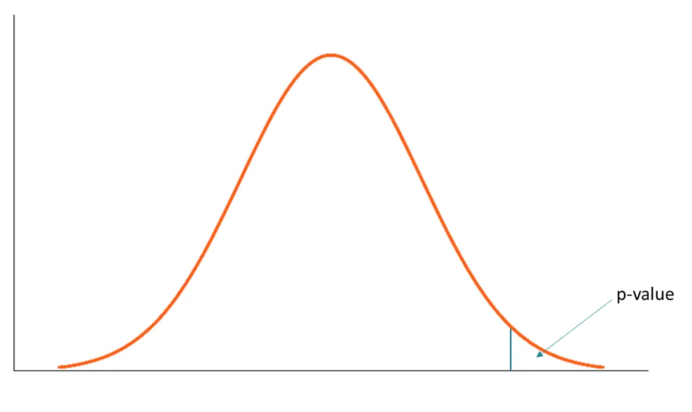

```{r}
#| echo: false
#| results: asis
source(here::here("R/utils.R"))
read_yaml_talks_pt()
```

------------------------------------------------------------------------

En muchas carreras científicas e ingenierías, la estadística se reduce a **calcular valores p** y compararlos con umbrales como *p < 0.05*, usándolos como un **veredicto automático** más que como parte de un razonamiento estadístico. Esto ha convertido al valor p en uno de los conceptos más **malinterpretados** de la estadística moderna, no por ser inútil, sino por su uso mecánico.

```{=html}
<figure style="text-align: center;">
  
  <figcaption>
    <strong>Figura 1:</strong> Uso de <em>p</em> &lt; 0.05 por tradición más que por justificación estadística.
  </figcaption>
</figure>
```


Frente a este problema, en 2016 la **American Statistical Association (ASA)** publicó la declaración [*“The ASA’s Statement on p-Values: Context, Process, and Purpose”*](https://www.tandfonline.com/doi/epdf/10.1080/00031305.2016.1154108?needAccess=true), cuyo objetivo no fue prohibir los valores p, sino **aclarar qué información entregan —y qué no—** sobre los datos y las hipótesis, explicitando principios que rara vez se discuten en la enseñanza tradicional.

Este post explora esas ideas **mediante simulaciones y ejemplos en R**, mostrando el carácter arbitrario del umbral *0.05* y cómo ciertas prácticas comunes pueden inducir a conclusiones engañosas. Está dirigido a quienes buscan comprender la inferencia estadística **más allá de recetas automáticas**, poniendo énfasis en el contexto, el diseño y la interpretación crítica.


## ¿Qué es un valor p?


```{=html}
<figure style="text-align: center;">
  
  <figcaption>
    <strong>Figura 2:</strong> Ejemplo gráfico de valor p.
  </figcaption>
</figure>
```


De manera informal, un **valor p** es la probabilidad de observar un resultado **igual o más extremo que el obtenido**, **asumiendo que un modelo estadístico específico es verdadero**. En la práctica, ese modelo suele corresponder a una *hipótesis nula* (por ejemplo, que no hay diferencia entre dos grupos o que el efecto es cero).

Es importante destacar desde el inicio qué **no** es un valor p:
- No es la probabilidad de que la hipótesis nula sea verdadera.
- No es la probabilidad de que los datos se deban al azar.
- Es una probabilidad calculada **condicionalmente al modelo asumido**.

Para entender esto mejor, en lugar de quedarnos solo con la definición, usaremos una simulación simple.

### Ejemplo: media muestral bajo la hipótesis nula

Supongamos que queremos evaluar si una muestra proviene de una población con media 0. Esa será nuestra hipótesis nula. Observamos una muestra y calculamos su media.

Luego preguntamos:  

> **¿Qué tan raro es este valor si la media poblacional realmente fuera 0?**


```{r}
set.seed(123)

# Muestra observada
x <- rnorm(30, mean = 0, sd = 1)
media_observada <- mean(x)
media_observada
```

Ahora simulamos muchas muestras **bajo la hipótesis nula** (media = 0) y calculamos sus medias.

```{r}
medias_simuladas <- replicate(10000, mean(rnorm(30, mean = 0, sd = 1)))
```

El valor p se obtiene contando cuántas de esas medias simuladas son **tan extremas o más extremas** que la observada.

```{r}
p_value <- mean(abs(medias_simuladas) >= abs(media_observada))
p_value
```

**Visualización de la distribución de valores p**

```{r}
hist(medias_simuladas,
     breaks = 40,
     col = "lightgray",
     main = "Distribución de la media bajo H₀",
     xlab = "Media muestral")

abline(v = media_observada,
       col = "red",
       lwd = 2)
```


> La línea roja representa la media observada.

El valor p corresponde al **área de la distribución** que queda tan lejos del centro como ese valor, bajo la hipótesis nula.

Un valor p **no evalúa directamente la hipótesis**, sino que responde a la pregunta:

> *Si el modelo asumido fuera correcto, ¿qué tan compatible es este resultado con lo que esperaríamos observar?*

Esta distinción es fundamental y será clave para entender por qué los valores p suelen malinterpretarse cuando se usan como veredictos automáticos.


## Principios sobre el uso e interpretación del valor p

La declaración de la ASA resume seis principios fundamentales sobre el valor p. En esta sección no los abordaremos de forma declarativa, sino que los exploraremos mediante ejemplos y simulaciones sencillas, para observar qué ocurre realmente cuando usamos valores p en distintos contextos.

### 1. El valor p mide incompatibilidad con un modelo, no con “la realidad”

Un valor p resume **qué tan incompatibles son los datos observados con un modelo estadístico específico**, usualmente asociado a una hipótesis nula (por ejemplo, “no hay efecto” o “no hay diferencia”).

Cuanto más pequeño es el valor p, mayor es la incompatibilidad entre los datos y el modelo asumido, **siempre que las suposiciones del modelo sean razonables**.

```{r}
set.seed(123)

x <- rnorm(30, mean = 0.4)
t.test(x, mu = 0)$p.value
```

Aquí el valor p no nos dice si el efecto es “real” o “importante”, solo indica que los datos no encajan bien con el modelo que supone media cero.

### 2. El valor p NO es la probabilidad de que la hipótesis sea verdadera

Un error muy común es interpretar el valor p como una probabilidad de que la hipótesis nula sea cierta, o como la probabilidad de que los datos se deban “al azar”. El valor p **no es ninguna de esas cosas**.

Veamos cómo el mismo efecto produce valores p distintos según el tamaño muestral:

```{r}
simular_p <- function(n) {
  x <- rnorm(n, mean = 0.2)
  t.test(x, mu = 0)$p.value
}

sapply(c(10, 50, 500, 5000), simular_p)
```

El efecto es el mismo, pero el valor p cambia drásticamente.


### 3. No se debe decidir solo por si p cruza un umbral

Reglas automáticas como *p < 0.05* reducen la inferencia científica a una decisión binaria artificial. No hay un salto cualitativo real entre *p = 0.049* y *p = 0.051*.

```{r}
pvals <- replicate(1000, simular_p(30))

hist(pvals, breaks = 40,
     col = "lightblue",
     main = "Distribución de valores p")
abline(v = 0.05, col = "red", lwd = 2, lty = 2)
```

El valor p es solo una pieza dentro de un razonamiento estadístico más amplio.


### 4. La inferencia válida requiere transparencia completa

Seleccionar resultados basándose en valores p conduce a prácticas como *p-hacking* o *cherry-picking*, que inflan artificialmente la cantidad de resultados “significativos”.

```{r}
pvals_hack <- replicate(1000, {
  x <- rnorm(30)
  t.test(x[1:sample(10:30, 1)], mu = 0)$p.value
})

hist(pvals_hack, breaks = 40,
     col = "tomato",
     main = "Distribución de p-values con selección")
```

Sin información completa sobre qué se analizó y qué se reportó, los valores p pierden interpretabilidad.


### 5. El valor p no mide el tamaño ni la importancia del efecto

La significancia estadística no equivale a importancia científica, social o práctica.

```{r}
small_effect <- rnorm(5000, mean = 0.1)
large_effect <- rnorm(10, mean = 1)

t.test(small_effect, mu = 0)$p.value
t.test(large_effect, mu = 0)$p.value
```

Un efecto pequeño puede ser altamente “significativo”, mientras que uno grande puede no serlo.


### 6. Un valor p, por sí solo, no es buena evidencia


Un valor p aislado entrega información limitada. Un valor cercano a 0.05 ofrece solo evidencia débil, y un valor grande no constituye evidencia a favor de la hipótesis nula.


```{=html}
<figure style="text-align: center;">
  
  <figcaption>
    <strong>Figura 3:</strong> Un valor <em>p</em> pequeño no implica automáticamente evidencia fuerte.
  </figcaption>
</figure>
```


Por eso, el análisis estadístico no debería terminar en el cálculo de un valor p, sino complementarse con:

* estimaciones,
* intervalos,
* visualizaciones,
* conocimiento del fenómeno,
* y evidencia externa.


## Conclusiones

El valor p es una herramienta útil para evaluar la compatibilidad entre los datos y un modelo estadístico, pero **no mide la verdad de una hipótesis ni la importancia de un resultado**. Su uso mecánico, especialmente mediante umbrales rígidos como *p < 0.05*, puede conducir a interpretaciones erróneas y decisiones poco fundamentadas.

Las ideas presentadas por la **American Statistical Association (ASA)** enfatizan que la inferencia estadística debe apoyarse en el contexto, el diseño del estudio y el razonamiento crítico, y no en reglas automáticas. Desde una perspectiva formativa, esto refuerza la necesidad de enseñar estadística más allá de recetas, promoviendo una comprensión profunda y reflexiva del análisis de datos.

> 📊 El problema no es usar valores p, sino enseñar estadística sin pensamiento estadístico.
