```{r}
#| echo: false
#| results: asis
source(here::here("R/utils.R"))
read_yaml_talks_pt()
```

------------------------------------------------------------------------

Las **Olimpiadas de Matemática en Chile** constituyen una competencia académica anual de resolución de problemas, dirigida a estudiantes de enseñanza básica y media. Se iniciaron en **1989**, bajo el nombre de **Olimpiada Nacional de Matemática** (u Olimpiada Chilena de Matemática), y desde entonces se han realizado de forma **ininterrumpida**.

Este certamen nació con un doble propósito:

-   Fomentar el gusto por las matemáticas.\
-   Detectar y potenciar jóvenes talentos, ofreciendo un espacio de encuentro entre estudiantes y docentes apasionados por la disciplina.

Sin embargo, más allá de su carácter competitivo, las Olimpiadas Matemáticas plantean una pregunta de fondo, profundamente pedagógica:

> **¿Por qué algunos estudiantes disfrutan pensar problemas difíciles, mientras otros solo ven en la matemática un conjunto de fórmulas que memorizar?**

```{=html}
<figure style="text-align: center;">
  
  <figcaption>
    <strong>Figura 1:</strong> Ejemplos de la persepción de los estudiantes en las Olimpiadas Matemáticas.
  </figcaption>
</figure>
```

Este post explora la historia y el sentido educativo de las Olimpiadas Matemáticas en Chile, abordando su origen, evolución, vínculos internacionales, objetivos formativos, impactos y debates pedagógicos asociados.

## Contexto histórico: ¿por qué nacen las Olimpiadas?

A fines de la década de 1980, Chile vivía un período de **renovación educativa y científica**, en sintonía con experiencias internacionales ya consolidadas, como:

-   La **Olimpiada Internacional de Matemática (IMO)**, activa desde 1959.\
-   La **Olimpiada Iberoamericana de Matemática (OIM)**, fundada en 1985.

Estas experiencias mostraron que las competencias matemáticas podían ser una poderosa herramienta para **descubrir talento oculto en las escuelas** y ofrecer **desafíos intelectuales de alto nivel**, muy distintos a los ejercicios rutinarios del aula tradicional.

En este contexto, un grupo de matemáticos chilenos impulsó en **1989** la creación de la Olimpiada Nacional de Matemática, coincidiendo además con el inicio de la **transición democrática**, cuando universidades y comunidades científicas recuperaban espacios de acción y liderazgo académico.

```{=html}
<figure style="text-align: center;">
  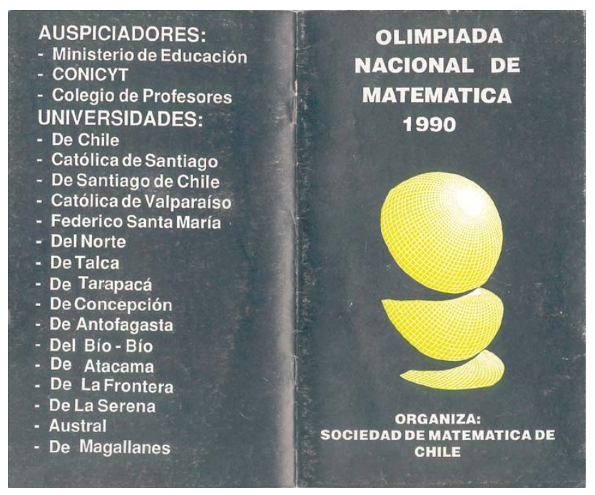
  <figcaption>
    <strong>Figura 2:</strong> Folleros de la Olimpiada Nacional de Matemática Chilena del 1990.
  </figcaption>
</figure>
```

## Instituciones involucradas y evolución del certamen

La organización de las Olimpiadas Matemáticas en Chile ha estado liderada desde su origen por la **Sociedad de Matemática de Chile (SOMACHI)**, que desde 1989 coordina el certamen junto a académicos de diversas universidades del país, entre ellas:

-   Universidad de Chile\
-   Pontificia Universidad Católica de Chile\
-   Universidad de Santiago\
-   Universidades regionales desde Arica hasta Punta Arenas

Con el tiempo, se consolidó una **red de sedes regionales**, lo que permitió descentralizar la participación y ampliar el acceso a estudiantes de todo el territorio.

```{=html}
<figure style="text-align: center;">
  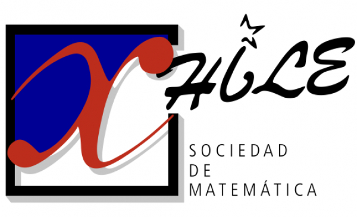
  <figcaption>
    <strong>Figura 3:</strong> Logo de la Sociedad de Matemática de Chile (SOMACHI).
  </figcaption>
</figure>
```

El proceso contó además con el apoyo de:

-   Ministerio de Educación (MINEDUC)\
-   Fundación Andes (especialmente en los años 90)\
-   CONICYT, a través de iniciativas de divulgación científica

Desde su primera edición, la Olimpiada ha crecido sostenidamente en **cobertura, participación e impacto**, dejando de ser una actividad de nicho para convertirse en un **evento académico nacional**.

### Estructura general del certamen

| **Aspecto**                 | **Descripción**                                                                |
|-----------------------------|-------------------------------------------|
| Etapas del certamen         | Etapa escolar → Prueba nacional clasificatoria → Gran Final Nacional           |
| Niveles de competencia\*\*  | Nivel Menor: hasta 15 años <br> Nivel Mayor: entre 16 y 18 años                |
| Áreas matemáticas evaluadas | Álgebra, geometría, combinatoria y teoría de números                           |
| Nivel de exigencia          | Exigencia conceptual significativamente superior al currículo escolar habitual |
| Participación               | Miles de estudiantes participan cada año a nivel nacional                      |

```{=html}
<figure style="text-align: center;">
  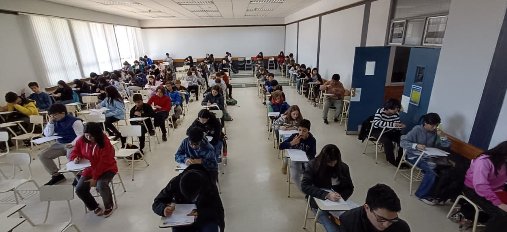
  <figcaption>
    <strong>Figura 4:</strong> Estudiantes realizando las pruebas de la Olimpiada Nacional de Matemática Chilena.
  </figcaption>
</figure>
```

## Crecimiento, impacto y proyección internacional

```{=html}
<figure style="text-align: center;">
  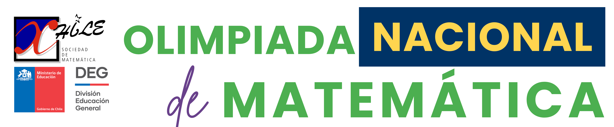
  <figcaption>
    <strong>Figura 5:</strong> Eslogan de la Olimpiada Nacional de Matemática Chilena.
  </figcaption>
</figure>
```

La Olimpiada Matemática Chilena ha experimentado un **crecimiento sostenido en participación** a lo largo del tiempo, lo que da cuenta de su alcance e impacto a nivel nacional:

-   **Años 2000:** alrededor de **3.000 participantes**
-   **2017:** más de **4.000 estudiantes inscritos**
-   **2025:** más de **8.000 participantes** en etapas locales

Estos números reflejan no solo una mayor convocatoria, sino también una ampliación de las oportunidades de acceso a una matemática más profunda. Más allá de las cifras, el impacto principal es formativo: **miles de estudiantes**, incluso quienes no llegan a instancias finales, experimentan por primera vez una matemática que invita a **pensar**, **explorar**, **argumentar** y **equivocarse**, alejándose de la mera repetición de procedimientos.

```{=html}
<figure style="text-align: center;">
  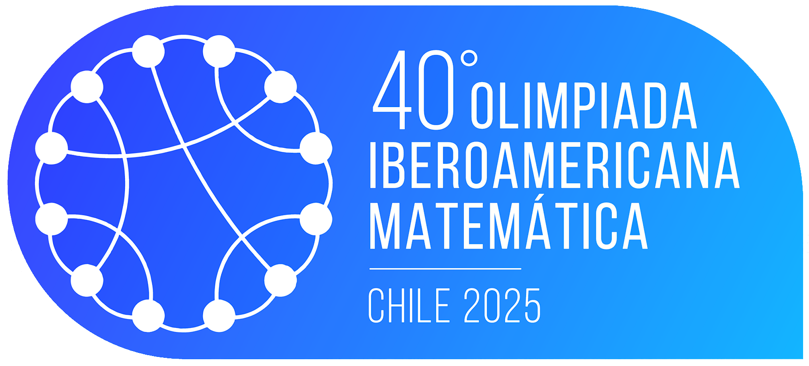
  <figcaption>
    <strong>Figura 6:</strong> Logo de las Olimpiadas Matemáticas Iberoamericanas 2025.
  </figcaption>
</figure>
```

La Olimpiada cumple además un rol clave como **instancia formativa y clasificatoria** para competencias matemáticas internacionales. Chile participa de manera sistemática en la **Olimpiada Iberoamericana de Matemática**, desde sus inicios, y ha sido país anfitrión en **1995, 2016 y 2025**, obteniendo medallas de oro, plata y bronce. Asimismo, participa en la **Olimpiada Internacional de Matemática** desde **1994**, con logros que incluyen medallas y menciones de honor.

Más allá de los resultados obtenidos, estas experiencias tienen un **alto valor educativo**: los estudiantes se enfrentan a problemas de máxima exigencia, interactúan con pares de otros países y, en muchos casos, regresan posteriormente como **monitores y formadores**, fortaleciendo el ciclo de aprendizaje y transmisión del conocimiento matemático.

## Impacto educativo

La Olimpiada Matemática Chilena ha tenido un impacto formativo significativo. Para muchos estudiantes, es el primer contacto con una matemática desafiante y creativa, despertando vocaciones en ciencias, matemáticas e ingeniería.

```{=html}
<figure style="text-align: center;">
  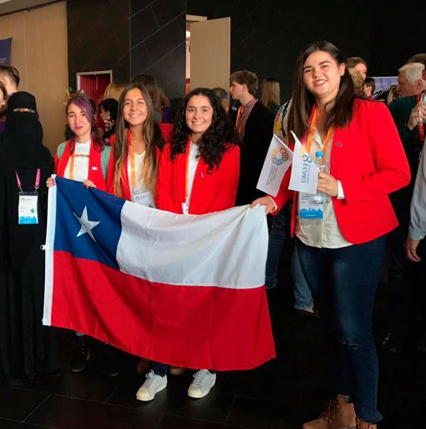
  <figcaption>
    <strong>Figura 7:</strong> Equipo de estudiantes participando en la Olimpiada de Matemática.
  </figcaption>
</figure>
```

Al mismo tiempo, ha impulsado en las escuelas la creación de talleres, clubes y prácticas pedagógicas centradas en la resolución de problemas y el pensamiento crítico. A nivel cultural, ha contribuido a revalorizar el logro intelectual, destacando el esfuerzo y el razonamiento como formas de talento que merecen reconocimiento.

## Objetivos formativos y filosofía

Las Olimpiadas Matemáticas promueven una visión de la matemática como un espacio de exploración, creatividad, argumentación y goce intelectual, alejándose de la aplicación mecánica de técnicas.

```{=html}
<figure style="text-align: center;">
  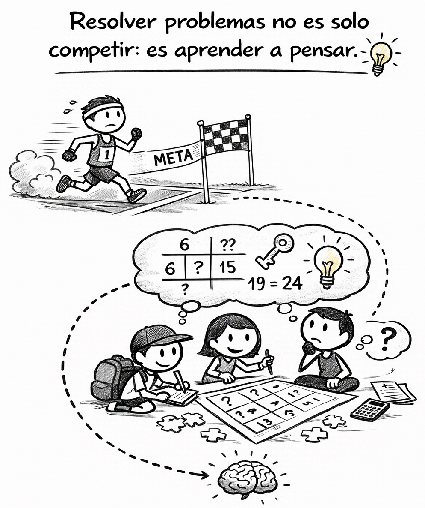
  <figcaption>
    <strong>Figura 8: </strong> Resolver problemas no es solo competir, es aprender a pensar.
  </figcaption>
</figure>
```

A través de problemas no rutinarios —frecuentemente ausentes del aula escolar— buscan desarrollar el potencial de los estudiantes, ampliar sus horizontes científicos y culturales, orientar vocaciones tempranas y favorecer la creación de comunidades académicas desde edades tempranas.

## Un ejemplo de problema olímpico

Considera el siguiente problema, típico de una Olimpiada Matemática escolar:

> En un tablero de ajedrez **8×8**, llamamos **trayectoria alba** a una secuencia de **8 casillas blancas**, una por cada fila, de modo que cada casilla se toque con la siguiente **en un vértice** (es decir, el movimiento entre filas es siempre en diagonal).
>
> **Pregunta:** ¿Cuántas trayectorias albas distintas existen?

```{=html}
<figure style="text-align: center;">
  
  <figcaption>
    <strong>Figura 9: </strong> Figuras de un tablero de ajedrez.
  </figcaption>
</figure>
```

No es necesario conocer una fórmula ni un método estándar para enfrentarlo. La pregunta clave es otra:

> **¿Qué tipo de pensamiento exige este problema que rara vez aparece en pruebas tradicionales?**

Este desafío no busca aplicar una técnica conocida, sino **explorar el problema**, representar información, reconocer patrones y **razonar paso a paso**. Es un ejemplo claro de matemática como actividad creativa y reflexiva, más que mecánica.

::: {.callout-tip collapse="true" title="Ver solución"}
Primero dibujemos el tablero de ajedrez:

::: {style="display: grid; grid-template-columns: repeat(1, 1fr); grid-gap: 1em;"}
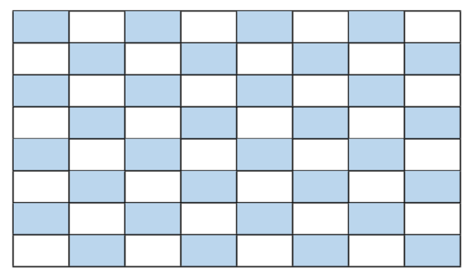{group="emma-latex"}
:::

Luego, dibujemos algunas trayectorias albas:

::: {style="display: grid; grid-template-columns: repeat(3, 1fr); grid-gap: 1em;"}
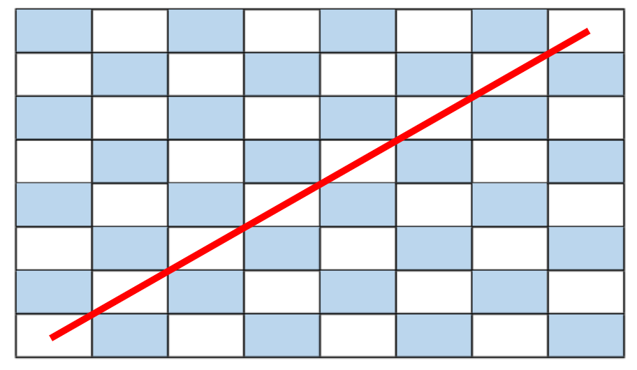{group="emma-latex"}

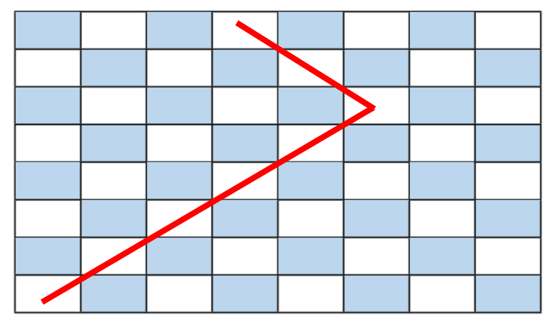{group="emma-latex"}

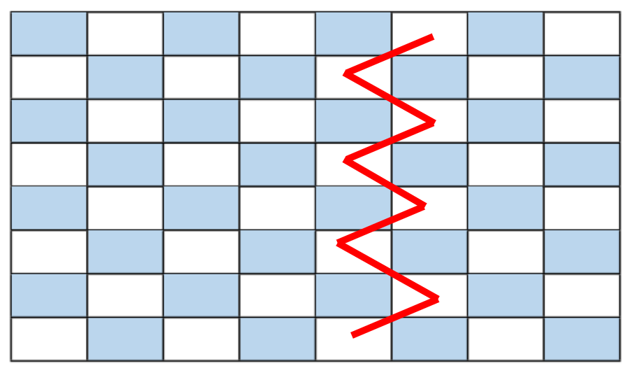{group="emma-latex"}
:::

Observemos que:

-   El problema consiste en ubicar una ficha en cada fila, tocando siempre a la anterior en un vértice.
-   La ficha parte en la fila 1 y llega a la fila 8 moviéndose solo **en diagonal** por casillas blancas.
-   El número de trayectorias se obtiene acumulando, paso a paso, las formas de llegar a cada casilla.

Considerando lo anterior:

::: {style="display: grid; grid-template-columns: repeat(3, 1fr); grid-gap: 1em;"}
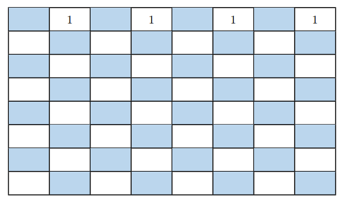{group="emma-latex"}

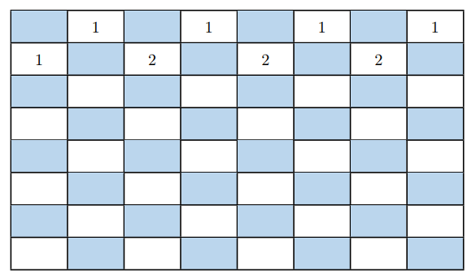{group="emma-latex"}

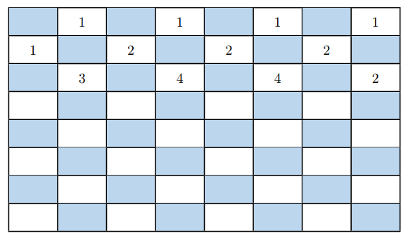{group="emma-latex"}
:::

Al completar el tablero y sumar todas las posibilidades de la última fila, se obtiene el resultado final:

::: {style="display: grid; grid-template-columns: repeat(1, 1fr); grid-gap: 1em;"}
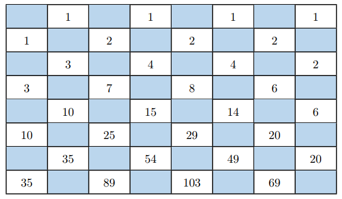{group="emma-latex"}
:::

> ✅ **Solución:** 35 + 89 + 103 + 69 = 296 trayectorias albas
:::

## Conclusiones

Las Olimpiadas Matemáticas en Chile representan una de las iniciativas más exitosas de **educación científica de largo plazo** en el país.

Han demostrado que:

-   El talento está distribuido en todo el territorio\
-   Con apoyo adecuado, los estudiantes pueden alcanzar niveles extraordinarios\
-   La matemática puede ser desafiante, bella y profundamente humana

> 🥇 Invertir en estas experiencias es fortalecer el capital humano y el pensamiento crítico.