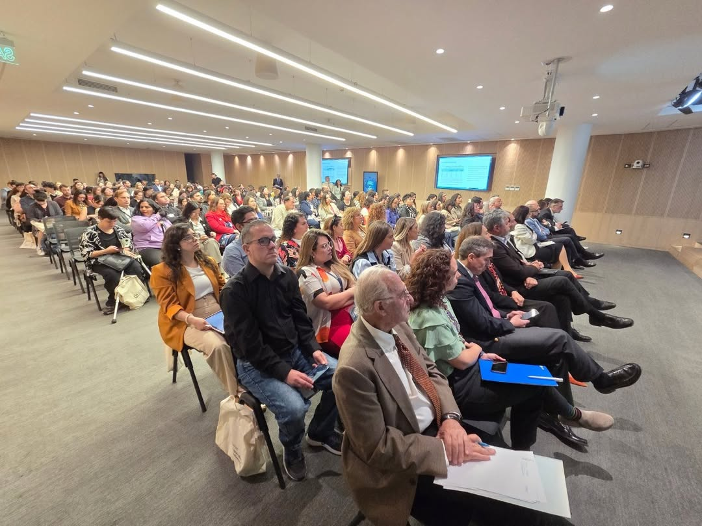
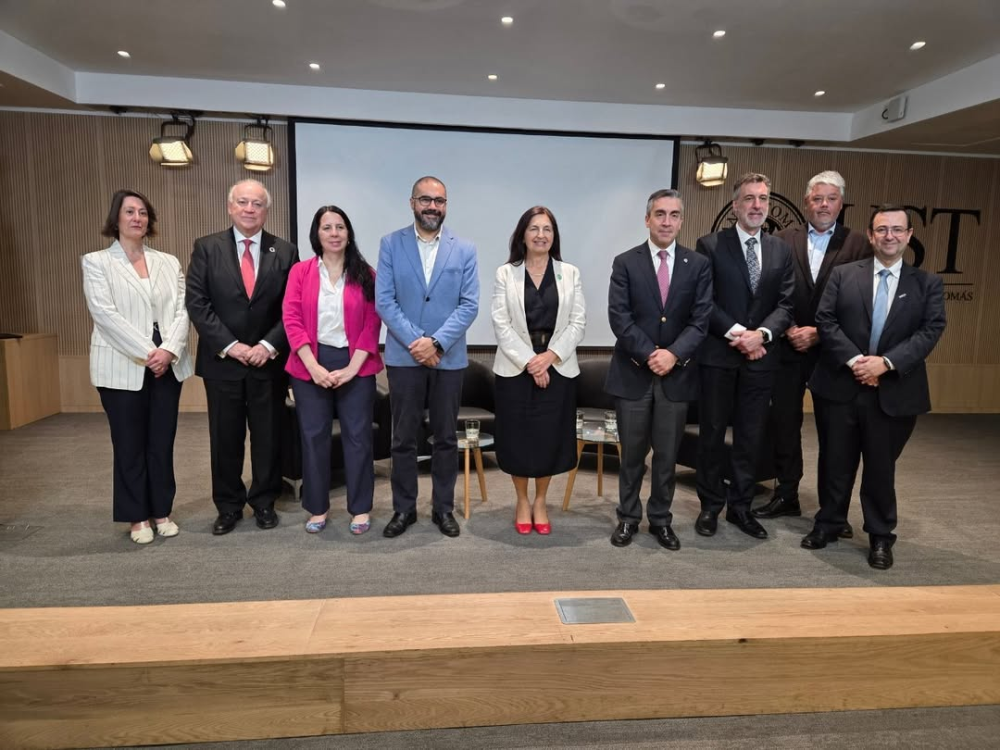
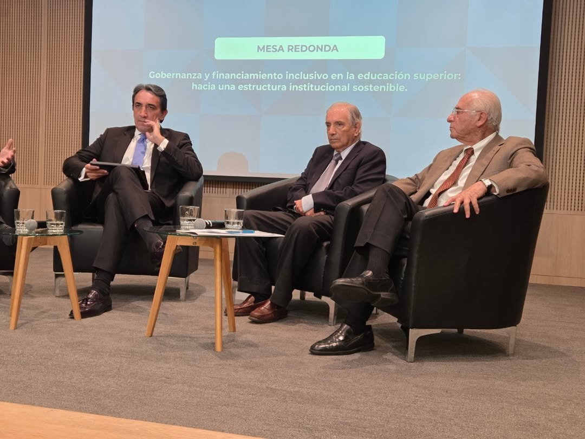

```{r}
#| echo: false
#| results: asis
source(here::here("R/utils.R"))
read_yaml_talks_pt()
```

------------------------------------------------------------------------

## 🎉 Participación en el II Congreso Internacional en Educación Superior Inclusiva

El **II Congreso Internacional en Educación Superior Inclusiva**, realizado en **Chile** y organizado por diversas instituciones académicas, buscó consolidar un espacio de **reflexión, investigación y diálogo** en torno a la inclusión en la educación superior.

El encuentro reunió a **autoridades, académicos, organismos públicos y organizaciones de la sociedad civil** con el propósito de fortalecer una educación superior más justa, equitativa y sostenible.

Los principales ejes temáticos del congreso fueron:

-   Avanzar hacia **políticas y prácticas inclusivas** en el sistema universitario.\
-   Fortalecer **redes interinstitucionales y cooperación internacional**.\
-   Generar aprendizajes desde la **investigación aplicada y experiencias de gestión**.

## 💡 Presentación: *Gobernanza Abierta e Inclusión Digital: Tecnologías Colaborativas en la Educación Superior*

La inclusión en la educación superior requiere no solo ajustes pedagógicos, sino también **modelos de gobernanza** que aseguren un acceso equitativo a los recursos. En este marco, las **tecnologías abiertas** —como *Quarto*, *Google Colab*, *Streamlit* y *GitHub*— surgen como alternativas sostenibles para reducir costos, eliminar barreras y promover la participación de estudiantes con diversas necesidades. Estas herramientas permiten crear y compartir materiales interactivos y accesibles, fomentando una docencia colaborativa, transparente y financieramente sostenible.

Los resultados preliminares muestran una **reducción de brechas tecnológicas**, **mayor participación estudiantil** y una **gestión más sostenible** de los recursos académicos. En conjunto, se refuerza la idea de que una **gobernanza digital abierta**, basada en el uso de software libre, puede fortalecer la inclusión y consolidar la educación como un bien común.

### 📷 Fotos del Evento

::: {style="display: grid; grid-template-columns: repeat(1, 1fr); grid-gap: 1em;"}
{group="emma-latex"}
:::

::: {style="display: grid; grid-template-columns: repeat(3, 1fr); grid-gap: 1em;"}
{group="emma-latex"}

{group="emma-latex"}

{group="emma-latex"}
:::

### 📋 Sobre la Presentación

**“Gobernanza Abierta e Inclusión Digital: Tecnologías Colaborativas en la Educación Superior”** es una propuesta que promueve el uso de **tecnologías abiertas como herramientas de equidad** en la educación universitaria.\
Desarrollada por **Francisco Alfaro**, esta experiencia demuestra cómo la **innovación tecnológica** y la **gobernanza colaborativa** pueden contribuir a **una educación inclusiva, accesible y sostenible** en el tiempo.

🌐 Más recursos y materiales en: <https://seth-nut.github.io/resources>