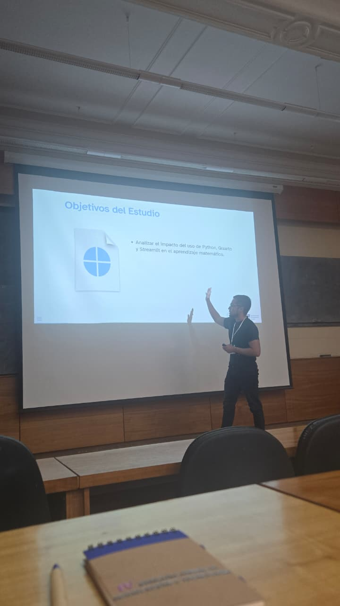
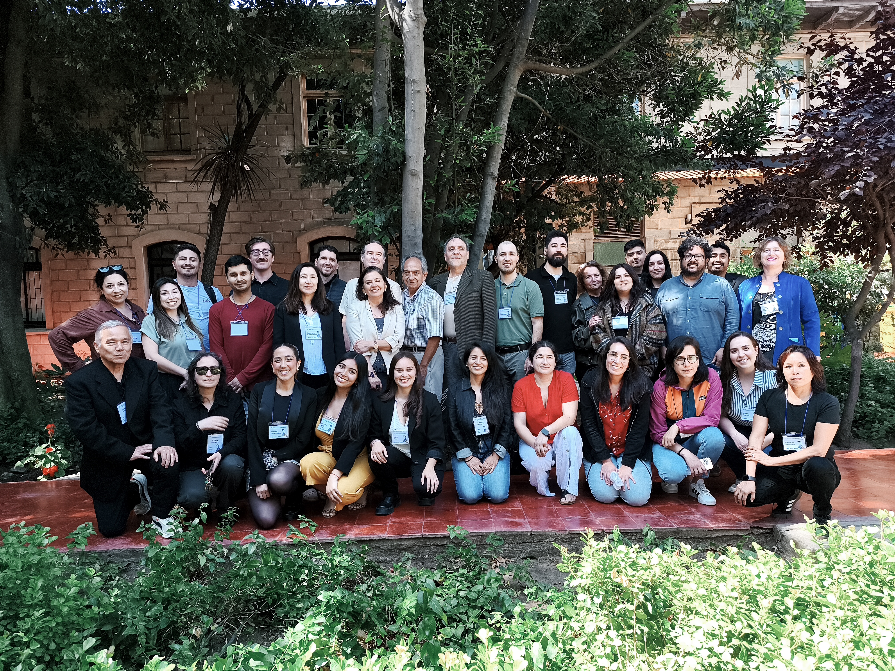
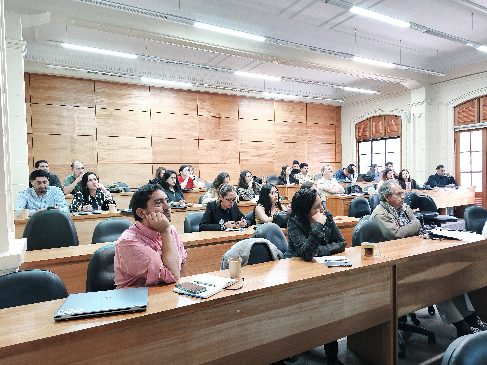
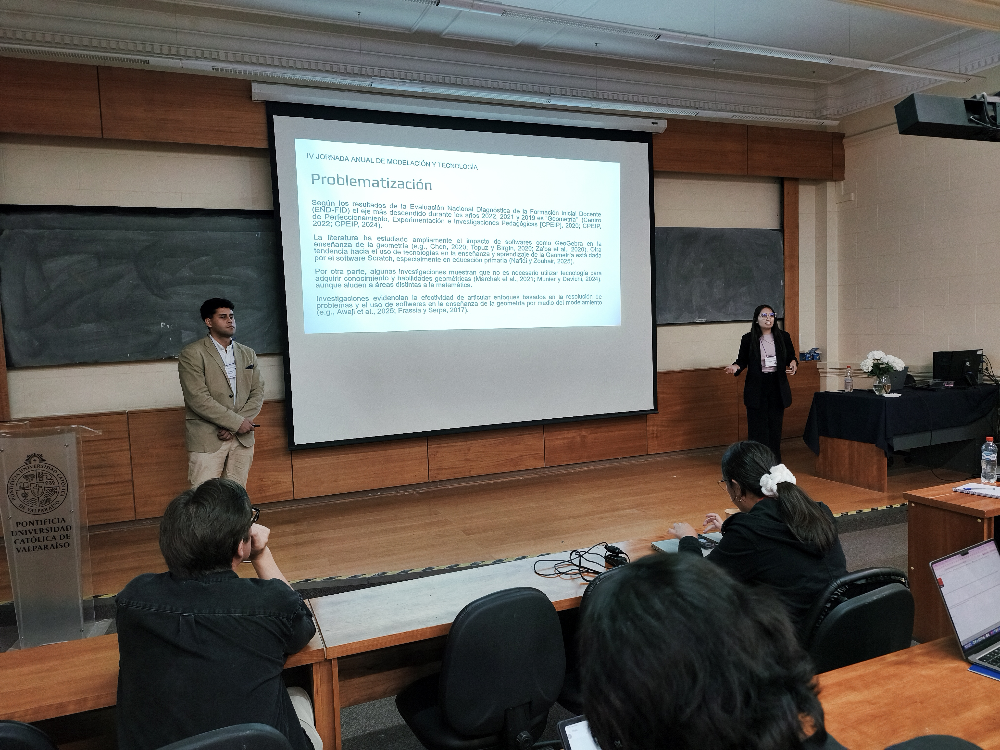
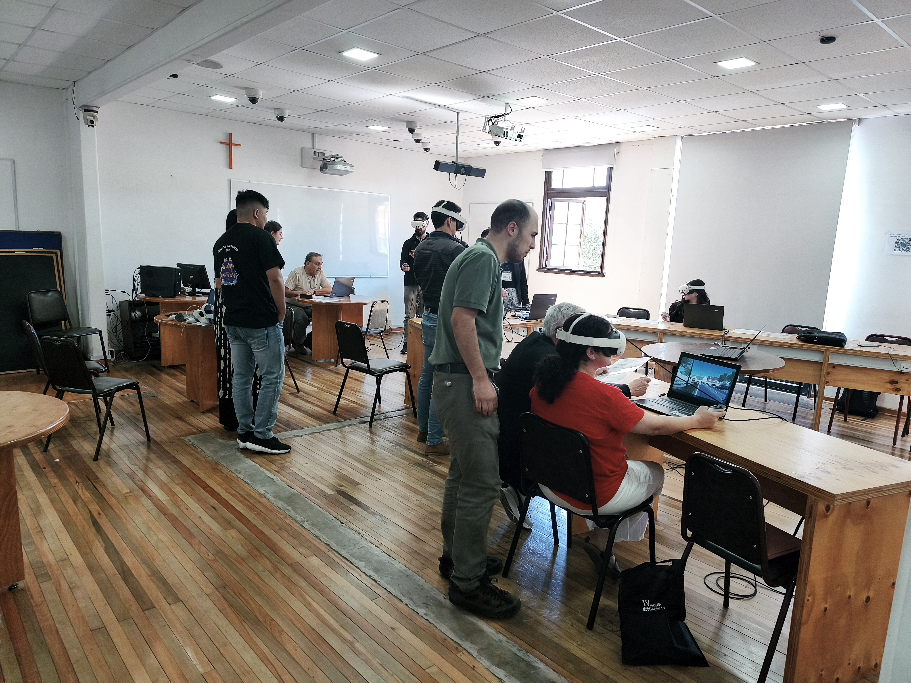

```{r}
#| echo: false
#| results: asis
source(here::here("R/utils.R"))
read_yaml_talks_pt()
```

------------------------------------------------------------------------

## 🎉 Participación en el Congreso **IV Jornada de Modelación y Tecnología en Educación Matemática**

La **IV Jornada de Modelación y Tecnología en Educación Matemática** es un espacio académico orientado a reflexionar sobre el rol de la modelación matemática y las tecnologías digitales en la formación de ciudadanos críticos, capaces de comprender, analizar y transformar su realidad.

El congreso destaca la importancia de la modelación para abordar fenómenos complejos (sociales, económicos, ambientales, etc.) y del uso consciente y ético de tecnologías, incluyendo herramientas de inteligencia artificial, como competencias clave para la educación matemática del siglo XXI.

### 🌟 Contenido Destacado de la Experiencia

La charla presenta una experiencia de **innovación en la enseñanza de la matemática escolar** desarrollada en dos instancias de extensión universitaria: las **Olimpiadas de Matemática USM (2024)** y el **Verano Matemático USM–UChile (2025)**, dirigidas a estudiantes de educación básica y media.

-   **Uso de Python** para promover modelación y simulación matemática.\
-   **Herramientas digitales abiertas** como **Quarto** y **Streamlit** para visualización interactiva.\
-   **Aprendizajes activos** y desarrollo del pensamiento computacional.\
-   **Participación de estudiantes de 13 a 17 años** (n ≈ 70).\
-   **Alta satisfacción** (media cercana a 9/10), destacando interactividad y motivación.

### 👏 Agradecimientos

Agradecemos a **Elisabeth Ramos Rodríguez** por su apoyo y gestión, fundamentales para el desarrollo de esta experiencia educativa.

### 📷 Fotos del Evento

::: {style="display: grid; grid-template-columns: repeat(1, 1fr); grid-gap: 1em;"}
{group="my-gallery" width="800px" height="1000px"}
:::

::: {style="display: grid; grid-template-columns: repeat(2, 1fr); grid-gap: 1em;"}
{group="my-gallery"}

{group="my-gallery"}
:::

::: {style="display: grid; grid-template-columns: repeat(2, 1fr); grid-gap: 1em;"}
{group="my-gallery"}

{group="my-gallery"}
:::

### 📋 Sobre la Propuesta

**“Innovación en la enseñanza de la matemática escolar con Python y herramientas digitales abiertas: evidencias desde talleres interactivos en educación básica y media”** es una propuesta que integra programación, modelación matemática y tecnología abierta para fortalecer la enseñanza escolar de la matemática.

La experiencia aporta evidencia sobre cómo enfoques basados en modelación, visualización e interactividad pueden mejorar la motivación estudiantil y promover una educación matemática **más inclusiva, crítica y alineada con los desafíos contemporáneos**.

🌐 Más recursos y materiales en: <https://seth-nut.github.io/resources>
