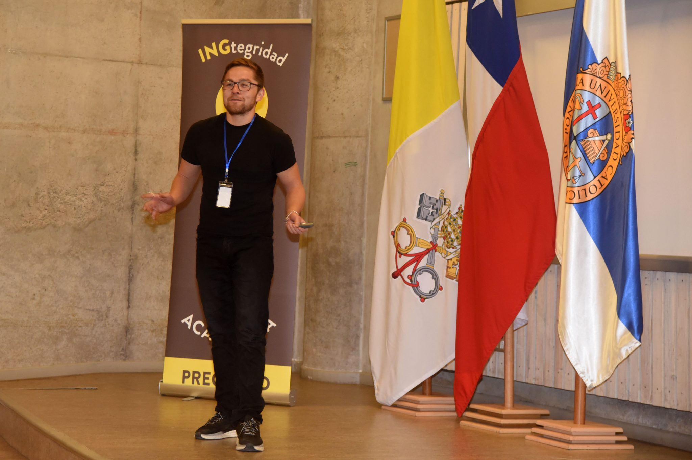
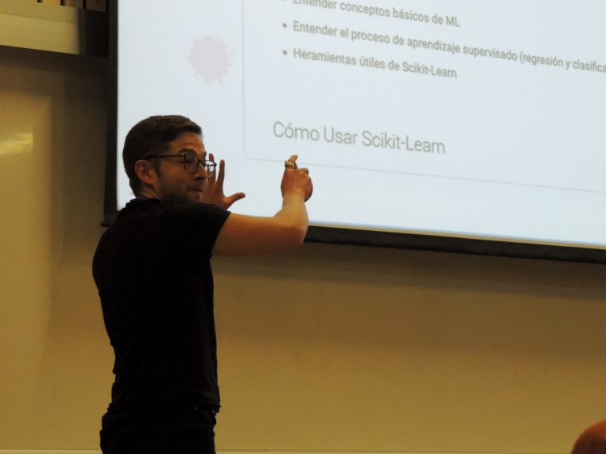
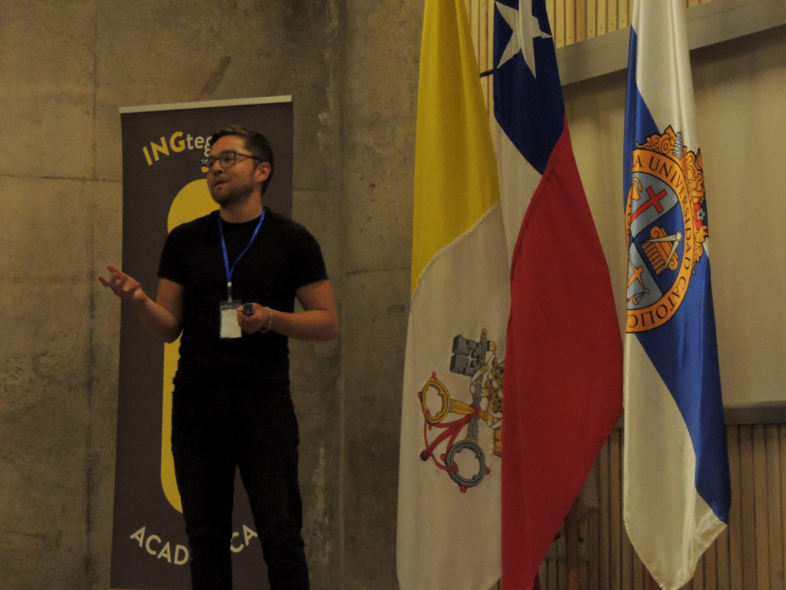
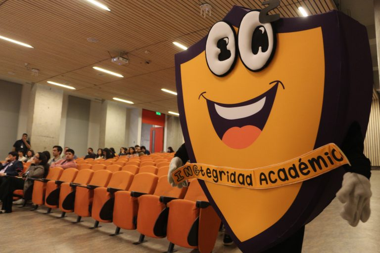
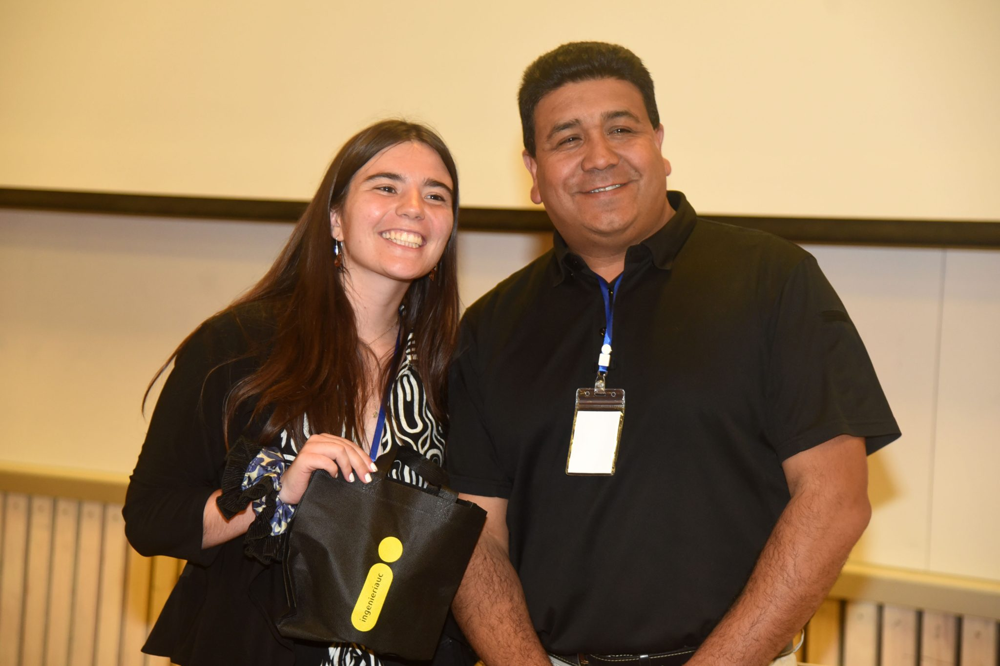
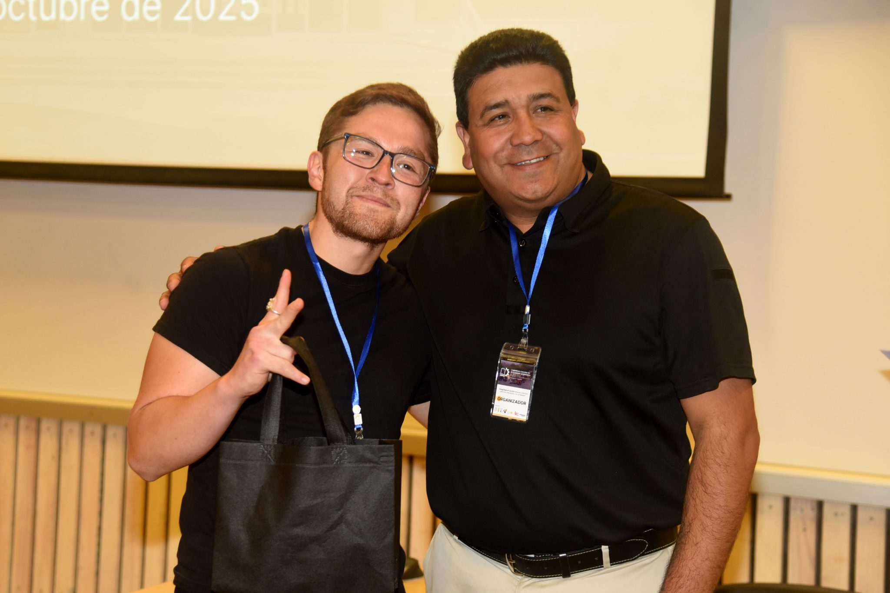
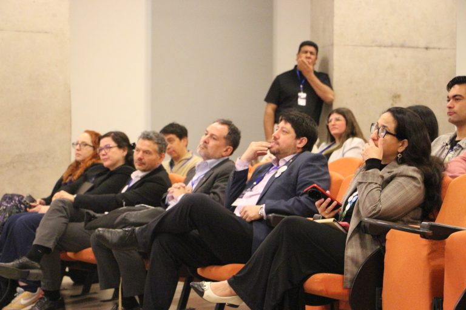

```{r}
#| echo: false
#| results: asis
source(here::here("R/utils.R"))
read_yaml_talks_pt()
```

------------------------------------------------------------------------

## 🎉 Participación en el Congreso Chileno de Integridad Académica 2025

Durante la primera edición del **Congreso Chileno de Integridad Académica**, organizado por la **Escuela de Ingeniería de la Pontificia Universidad Católica de Chile**, la comunidad académica se reunió para reflexionar sobre la importancia de la **transparencia, la honestidad y la responsabilidad** en los procesos formativos de la educación superior.

El encuentro, realizado en la ciudad de **Santiago**, tuvo como eje central el tema **“Integridad en acción: buenas prácticas para una educación con propósito”**, y se consolidó como un espacio pionero para compartir experiencias, difundir buenas prácticas y proyectar una cultura institucional basada en la confianza y la ética académica.

A través de conferencias, paneles y espacios de diálogo, el Congreso convocó a académicos, profesionales y estudiantes interesados en construir una educación **innovadora, inclusiva y comprometida con la integridad.**

## 💡 Charla: *Integridad Académica en Acción: Innovación con Open Source e IA Ética*

La ponencia **“Integridad académica en acción: innovación con open source e IA ética”** presentó una propuesta práctica para fortalecer la integridad académica mediante el uso de **tecnologías abiertas** y **herramientas de inteligencia artificial** en la enseñanza universitaria. A través de experiencias con **Quarto**, **GitHub** y **Google Colab**, se mostró cómo la apertura y la colaboración promueven la transparencia y reducen los incentivos a prácticas deshonestas, fomentando valores de honestidad y responsabilidad.

También se abordó el uso ético de **ChatGPT** y **Gemini** en contextos educativos, destacando su potencial para desarrollar pensamiento crítico y creatividad cuando se integran de forma reflexiva. En conjunto, la charla planteó que la **integridad académica** debe entenderse como una práctica viva y transversal, impulsada por una educación **abierta, ética y con propósito**, donde la confianza y la excelencia se construyen colectivamente.

### 📷 Fotos del Evento

::: {style="display: grid; grid-template-columns: repeat(1, 1fr); grid-gap: 1em;"}
{group="emma-latex"}
:::

::: {style="display: grid; grid-template-columns: repeat(2, 1fr); grid-gap: 1em;"}
{group="emma-latex"}

{group="emma-latex"}
:::

::: {style="display: grid; grid-template-columns: repeat(4, 1fr); grid-gap: 1em;"}
{group="emma-latex"}

{group="emma-latex"}

{group="emma-latex"}

{group="emma-latex"}
:::

### 📋 Sobre la Charla

**“Integridad Académica en Acción: Innovación con Open Source e IA Ética”** es una propuesta formativa creada por **Francisco Alfaro** (UTFSM), que busca **unir la ética con la innovación tecnológica** en el aula universitaria.\
Su objetivo es demostrar que la transparencia, la colaboración y el uso responsable de la IA pueden coexistir armónicamente con los valores fundamentales de la educación superior.

🌐 Más recursos y materiales en: <https://seth-nut.github.io/resources>