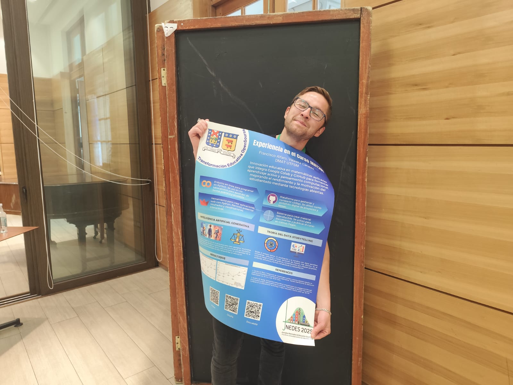
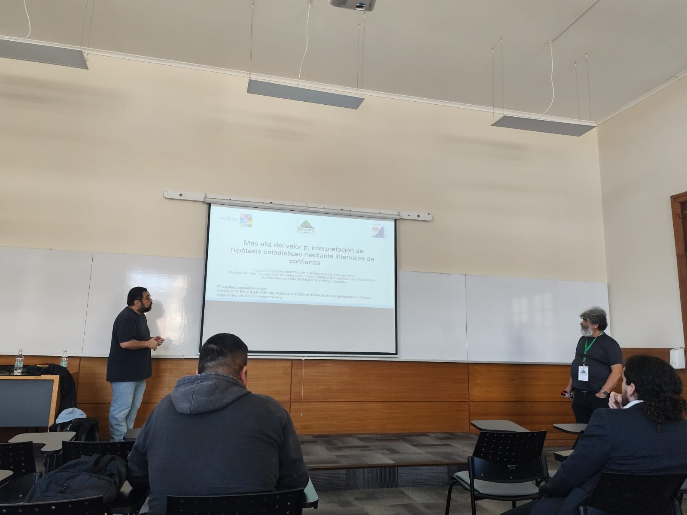
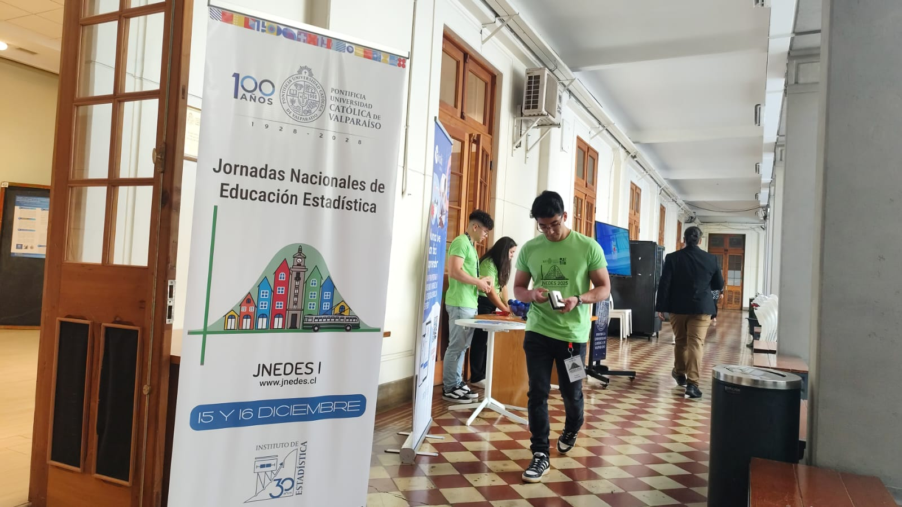
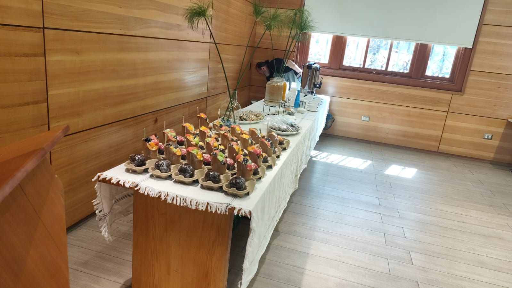

```{r}
#| echo: false
#| results: asis
source(here::here("R/utils.R"))
read_yaml_talks_pt()
```

------------------------------------------------------------------------

## 🎉 Participación en el Congreso **1ª Jornada Nacional de Educación Estadística de Chile (JNEDES 1)**

La **1ª Jornada Nacional de Educación Estadística de Chile (JNEDES 1)** busca generar un espacio de reflexión, intercambio de experiencias y discusión sobre los **desafíos actuales de la educación estadística y matemática**, promoviendo prácticas innovadoras, inclusivas y contextualizadas.

El congreso convoca a docentes e investigadores interesados en fortalecer la enseñanza de la estadística y las matemáticas aplicadas, integrando tecnologías educativas y enfoques pedagógicos centrados en el aprendizaje activo.

### 🌟 Contenido Destacado de la Experiencia

La charla presenta una experiencia de **innovación pedagógica** desarrollada en el curso universitario **Aplicaciones de las Matemáticas (MAT281)** de la Universidad Técnica Federico Santa María, enfocada en la transformación de la enseñanza de la programación y el análisis de datos.

-   **Uso de Google Colab** como entorno principal de programación.\
-   **Evaluaciones interactivas** orientadas al aprendizaje activo.\
-   **Portafolios digitales en GitHub** para el seguimiento del trabajo estudiantil.\
-   **Enfoque en problemas reales**, implementado progresivamente entre 2019 y 2024.\
-   **Mejoras sostenidas** en rendimiento académico y percepción docente.

Los resultados evidencian el impacto positivo de las **tecnologías abiertas y accesibles** en la enseñanza universitaria, promoviendo inclusión, autonomía y motivación estudiantil.

### 👏 Agradecimientos

Agradecemos a **Patricio Videla Jiménez** y **Bárbara Villarroel Oyarzo** por su gestión y apoyo, fundamentales para el desarrollo de esta experiencia educativa.

### 📷 Fotos del Evento

::: {style="display: grid; grid-template-columns: repeat(1, 1fr); grid-gap: 1em;"}
{group="my-gallery"}
:::

::: {style="display: grid; grid-template-columns: repeat(3, 1fr); grid-gap: 1em;"}
{group="my-gallery" width="250px" height="150px"}

{group="my-gallery" width="250px" height="150px"}

{group="my-gallery" width="250px" height="150px"}
:::

### 📋 Sobre la Propuesta

**“Transformación Educativa en Matemáticas Aplicadas con Google Colab: Experiencia en el Curso MAT281”** es una propuesta que busca aportar evidencia sobre cómo el uso de herramientas digitales abiertas puede transformar la enseñanza universitaria en matemáticas y ciencia de datos.

La experiencia propone un modelo replicable para otros cursos y contextos educativos, fortaleciendo una educación matemática **más activa, inclusiva y alineada con los desafíos actuales**.

🌐 Más recursos y materiales en: <https://seth-nut.github.io/resources>
