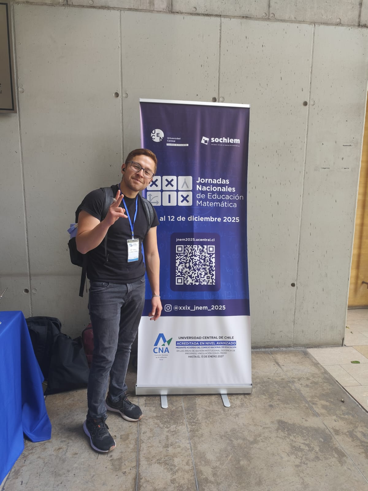
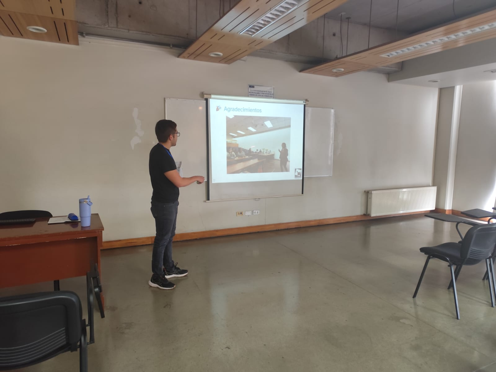
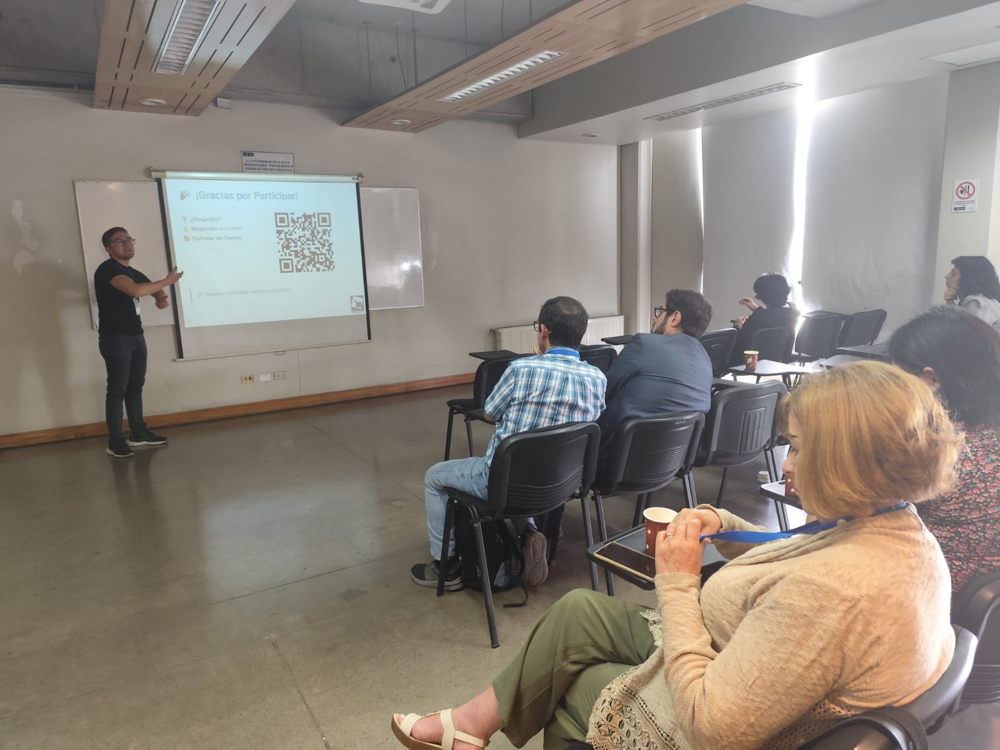
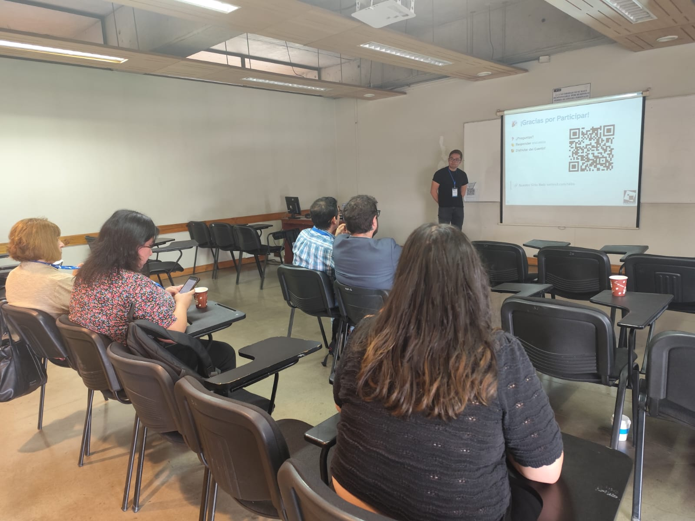

```{r}
#| echo: false
#| results: asis
source(here::here("R/utils.R"))
read_yaml_talks_pt()
```

------------------------------------------------------------------------

## 🎉 Participación en el Congreso **XXIX Jornadas Nacionales de Educación Matemática**

Las **XXIX Jornadas Nacionales de Educación Matemática** se centran en los desafíos actuales de la educación matemática frente a una formación para el siglo XXI. El congreso promueve estrategias pedagógicas orientadas a la **inclusión**, la **formación ciudadana**, el intercambio de **experiencias significativas** y el fortalecimiento del **trabajo colaborativo** entre docentes, investigadores y otros actores del sistema educativo.

Este espacio busca visibilizar prácticas innovadoras que integren tecnología, enfoques pedagógicos actuales y una mirada crítica sobre la enseñanza y el aprendizaje de la matemática en distintos niveles educativos.

### 🌟 Contenido Destacado de la Experiencia

En el marco del **Encuentro de Mujeres Matemáticas (EMMA)** se realizaron dos talleres orientados a promover la **participación femenina en matemática** mediante tecnologías digitales abiertas.

-   **¡Adiós Word, Hola LaTeX!**: uso de LaTeX y Overleaf para escritura académica.\
-   **No es Magia, es Ciencia**: introducción a modelos de lenguaje (LLM) y diseño de *prompts*.\
-   **Quarto** como plataforma para presentaciones interactivas y ejercicios prácticos.\
-   **Alta participación femenina** en las sedes Casa Central y San Joaquín.\
-   **Evaluación promedio superior a 9/10**, destacando claridad, utilidad y motivación.

### 👏 Agradecimientos

Agradecemos a **Daniela Araya Bastías** y **Bárbara Villarroel Oyarzo** por su gestión y el apoyo brindado, fundamentales para el desarrollo de esta experiencia educativa.

### 📷 Fotos del Evento

::: {style="display: grid; grid-template-columns: repeat(1, 1fr); grid-gap: 1em;"}
{group="my-gallery"}
:::

::: {style="display: grid; grid-template-columns: repeat(3, 1fr); grid-gap: 1em;"}
{group="my-gallery"}

{group="my-gallery"}

{group="my-gallery"}
:::

::: {style="display: grid; grid-template-columns: repeat(3, 1fr); grid-gap: 1em;"}
{group="my-gallery"}

{group="my-gallery"}

{group="my-gallery"}
:::

### 📋 Sobre la Propuesta

**“EMMA: Talleres de LaTeX e IA con Quarto para promover la participación de mujeres en matemática”** es una experiencia educativa orientada a generar espacios inclusivos de formación, combinando herramientas digitales abiertas, tecnologías emergentes y referentes femeninos en matemática.

La iniciativa propone un modelo replicable para contextos universitarios y escolares, contribuyendo a una educación matemática **más equitativa, actualizada y socialmente comprometida**.

🌐 Más recursos y materiales en: <https://seth-nut.github.io/resources>
