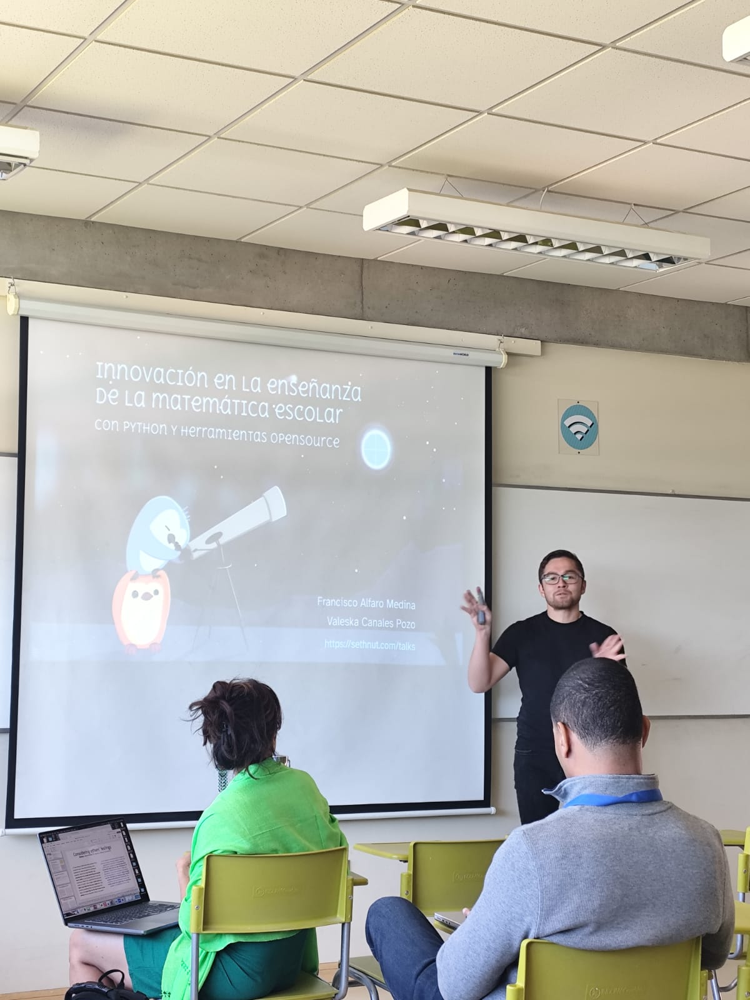
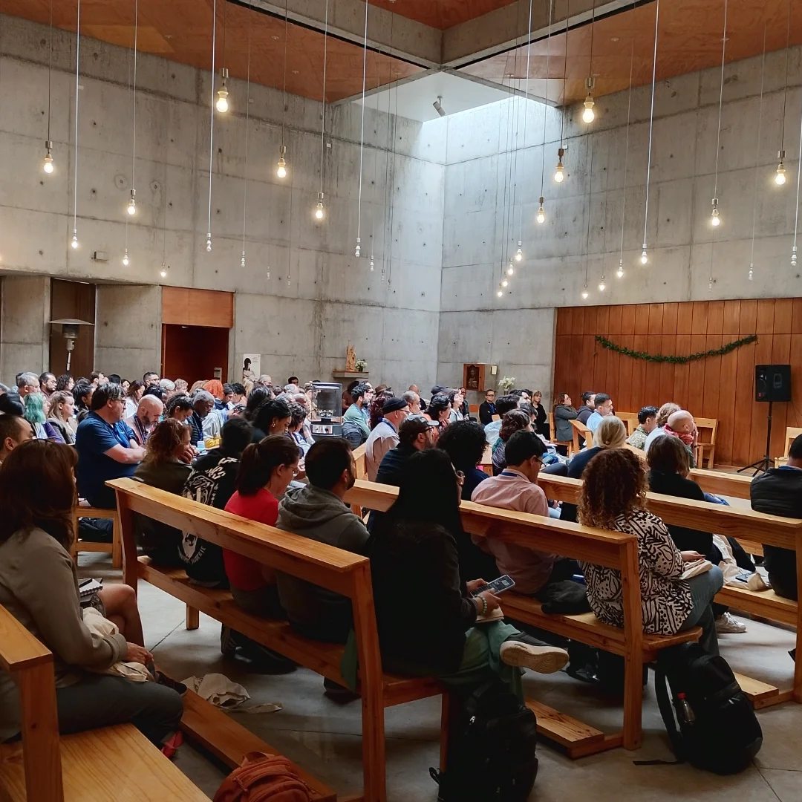
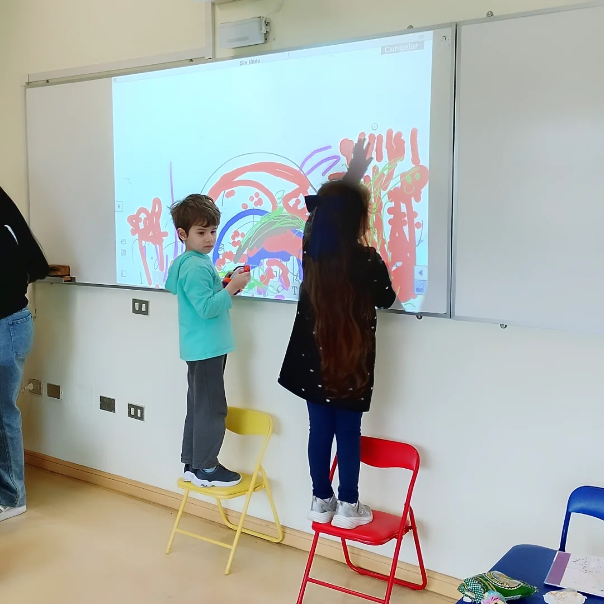
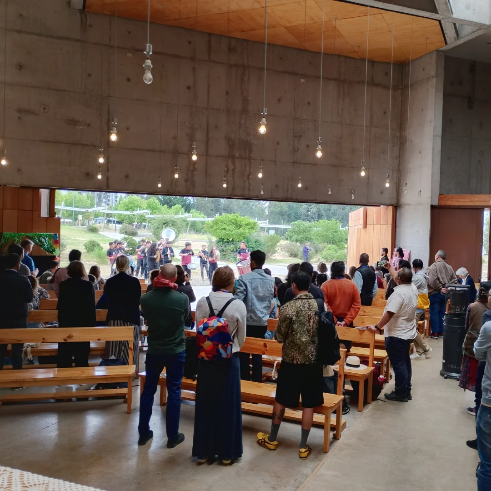
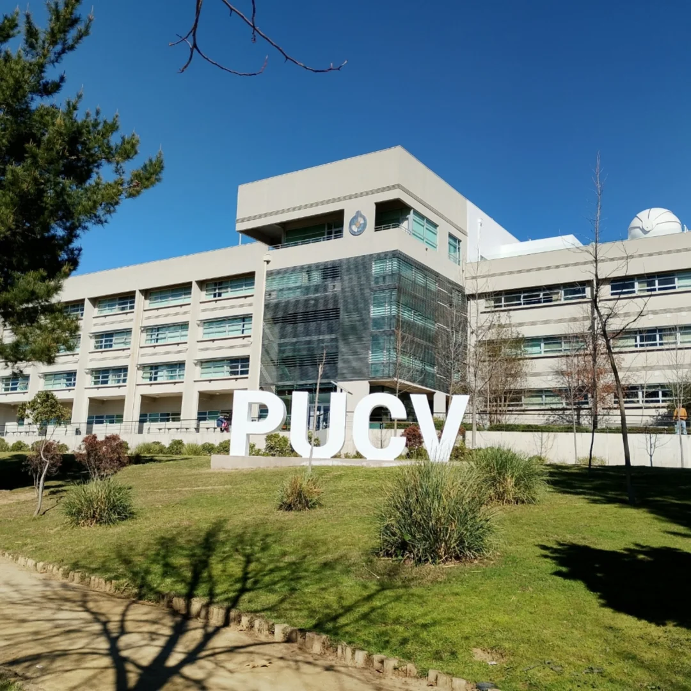
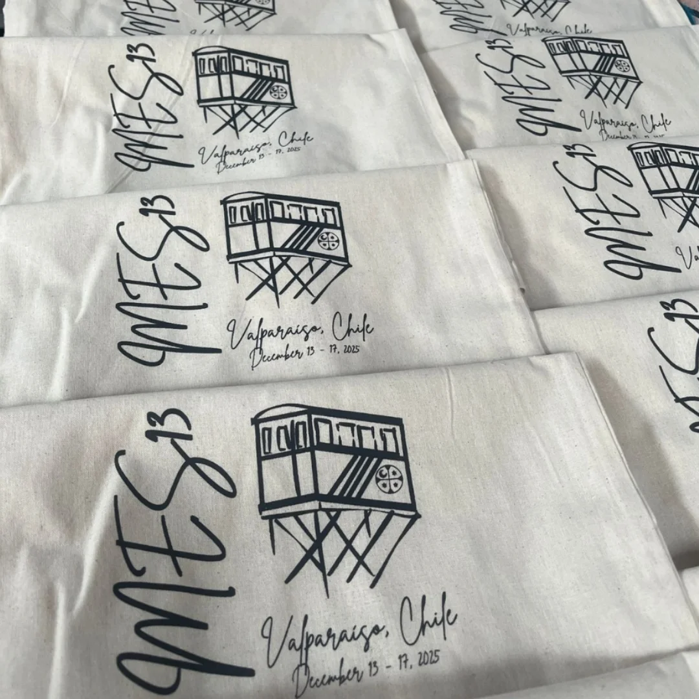
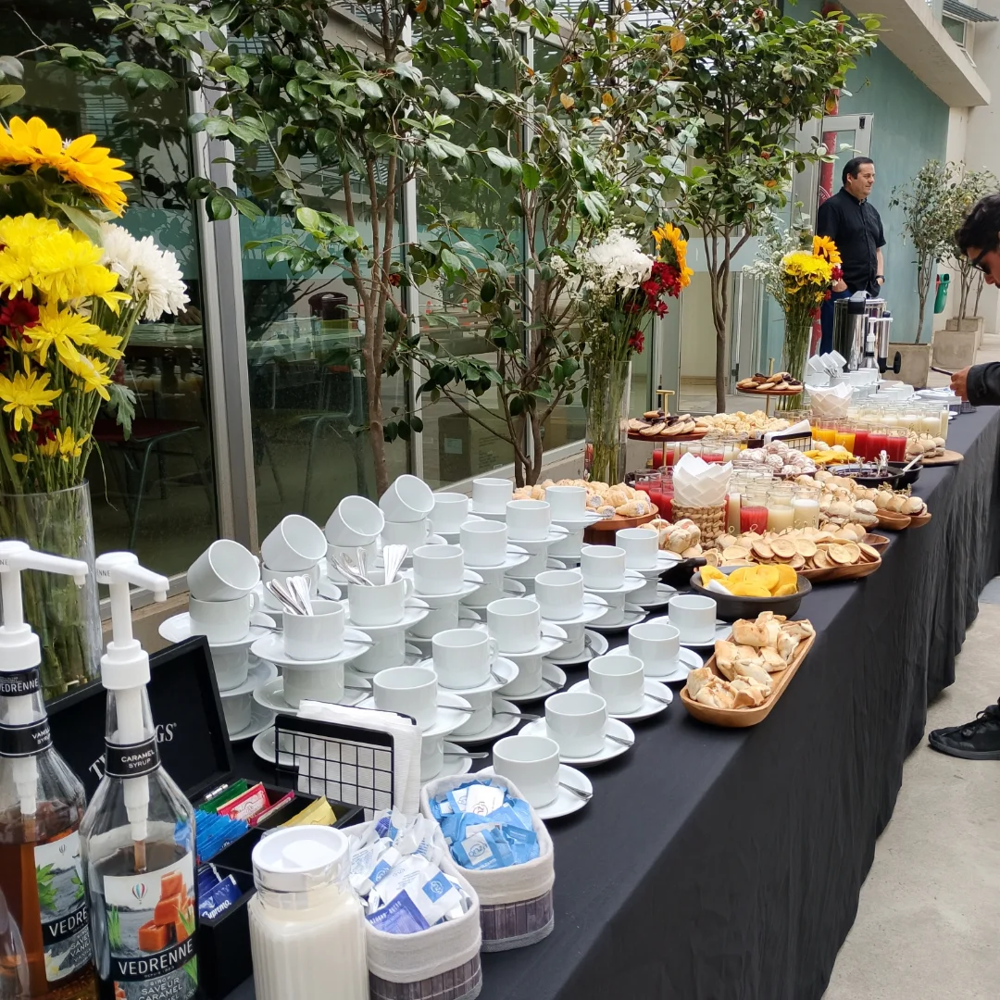

```{r}
#| echo: false
#| results: asis
source(here::here("R/utils.R"))
read_yaml_talks_pt()
```

------------------------------------------------------------------------

## 🎉 Participación en el Congreso **Mathematics Education and Society (MES)**

El congreso **Mathematics Education and Society (MES)** es un espacio internacional que promueve la reflexión crítica sobre las **dimensiones sociales, culturales y políticas de la educación matemática**. Desde 1998, MES reúne a investigadores y docentes interesados en conectar la enseñanza de la matemática con problemáticas sociales y educativas contemporáneas.

El encuentro convoca a educadores de distintos países para **compartir investigaciones, experiencias de aula y enfoques metodológicos alternativos**, abordando temas como la política de la educación matemática, la sociología del aprendizaje y los aspectos culturales de la enseñanza.

A través de conferencias y espacios de diálogo, MES se consolida como un foro que impulsa una educación matemática **crítica, inclusiva y socialmente comprometida**.

### 🌟 Contenido Destacado de la Charla

La charla presentó una experiencia educativa innovadora desarrollada en contextos escolares reales, orientada a fortalecer el aprendizaje de la matemática escolar mediante enfoques activos, visuales y contextualizados. La iniciativa fue implementada en el marco de las **Olimpiadas de Matemática USM** y el **Verano Matemático USM–UChile**, integrando programación y tecnologías abiertas como apoyo a la enseñanza.

-   **Talleres interactivos con Python** para matemática escolar en educación básica y media.\
-   **Herramientas digitales abiertas** (Quarto y Pyodide) para aprendizaje activo y visual.\
-   **Alta participación estudiantil**, con cerca de **70 estudiantes** entre 13 y 17 años.\
-   **Resultados positivos**, evidenciando mayor motivación y aprendizajes significativos.

### 👏 Agradecimientos

Agradecemos a **Melissa Andrade-Molina** y **Alex Montecino Muñoz** por su gestión y el apoyo brindado, fundamentales para el desarrollo de esta experiencia educativa.

### 📷 Fotos del Evento

::: {style="display: grid; grid-template-columns: repeat(1, 1fr); grid-gap: 1em;"}
{group="my-gallery"}
:::

::: {style="display: grid; grid-template-columns: repeat(3, 1fr); grid-gap: 1em;"}
{group="my-gallery"}

{group="my-gallery"}

{group="my-gallery"}
:::

::: {style="display: grid; grid-template-columns: repeat(3, 1fr); grid-gap: 1em;"}
{group="my-gallery"}

{group="my-gallery"}

{group="my-gallery"}
:::

### 📋 Sobre la Charla

**“Innovación en la enseñanza de la matemática escolar con Python y herramientas digitales abiertas”** es una propuesta desarrollada por **Francisco Alfaro** (UTFSM), orientada a integrar programación, tecnología abierta y educación matemática.

La iniciativa busca fortalecer la motivación estudiantil y ofrecer un modelo replicable para distintos contextos educativos, promoviendo una enseñanza de la matemática más accesible, participativa y significativa.

🌐 Más recursos y materiales en: <https://seth-nut.github.io/resources>
