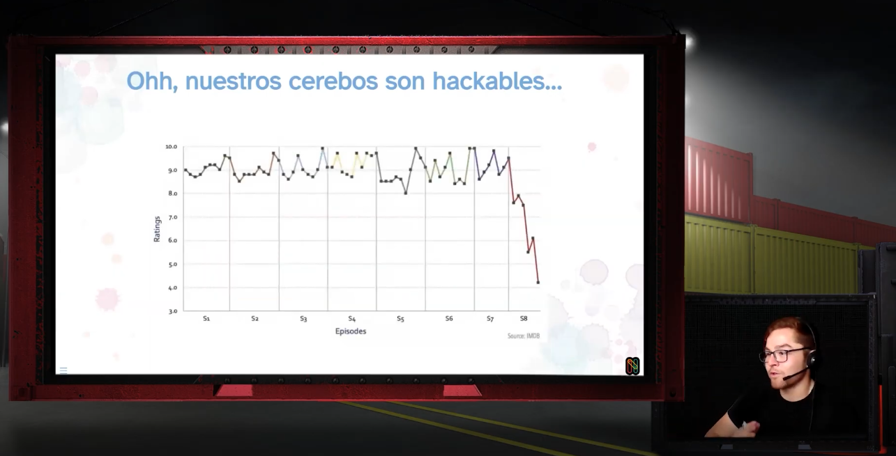

```{r}
#| echo: false
#| results: asis
source(here::here("R/utils.R"))
read_yaml_talks_pt()
```

------------------------------------------------------------------------

## 🎉 Charla en Nerdearla España 2025: *Crea, Innova y Presenta — Data Storytelling + A.I.*

En el marco de **Nerdearla España 2025**, se presentó la charla **“Crea, Innova y Presenta: Data Storytelling + A.I.”**, una invitación a repensar cómo comunicamos datos en un contexto donde la visualización, la automatización y la inteligencia artificial cumplen un rol clave en la toma de decisiones.

La propuesta estuvo dirigida a desarrolladores, analistas, profesionales y educadores interesados en **transformar datos en narrativas claras, interactivas y con impacto**.

### 💡 Sobre la charla

La charla mostró cómo integrar **visualización, narrativa y automatización** mediante herramientas modernas del ecosistema Python, combinando buenas prácticas de diseño con flujos de trabajo reproducibles.

Se abordaron los siguientes ejes principales:

-   **Visualizaciones interactivas** con Plotly y Streamlit.
-   **Narrativa asistida por IA** usando modelos de lenguaje como ChatGPT.
-   **Automatización de reportes y dashboards** con Quarto Markdown.
-   **Principios de diseño y visualización** (propósito, contenido, estructura y forma).
-   **Casos prácticos** aplicados a contextos corporativos y educativos.

### 👏 Agradecimientos

Un agradecimiento especial a la **comunidad de Nerdearla España** y a su equipo organizador por generar un espacio abierto donde convergen la **tecnología, la creatividad y la colaboración**.

Asimismo, gracias a todas las personas que asistieron a la charla y compartieron su interés por mejorar la forma en que comunicamos datos y resultados analíticos.

### 📷 Fotos del Evento

::: {style="display: grid; grid-template-columns: repeat(1, 1fr); grid-gap: 1em;"}
{group="my-gallery"}
:::

### 📚 Sobre la propuesta

**“Crea, Innova y Presenta: Data Storytelling + A.I.”** es una charla de divulgación enfocada en fortalecer la **comunicación efectiva con datos**, integrando visualización, diseño e inteligencia artificial con herramientas abiertas y reproducibles.

🌐 Más recursos en: <https://seth-nut.github.io/resources>

