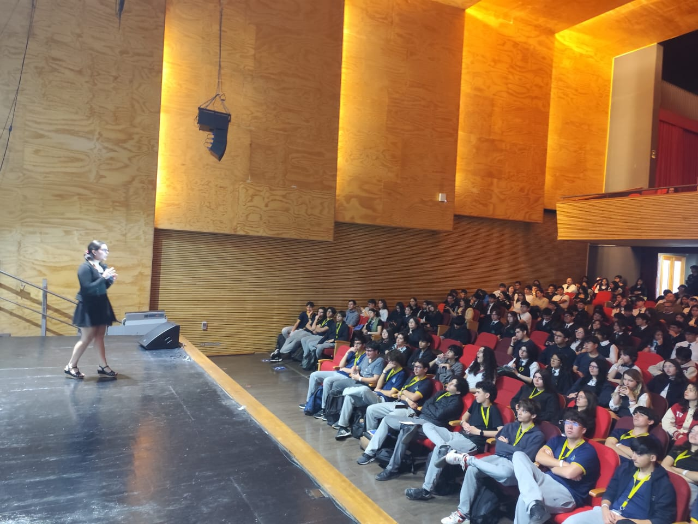
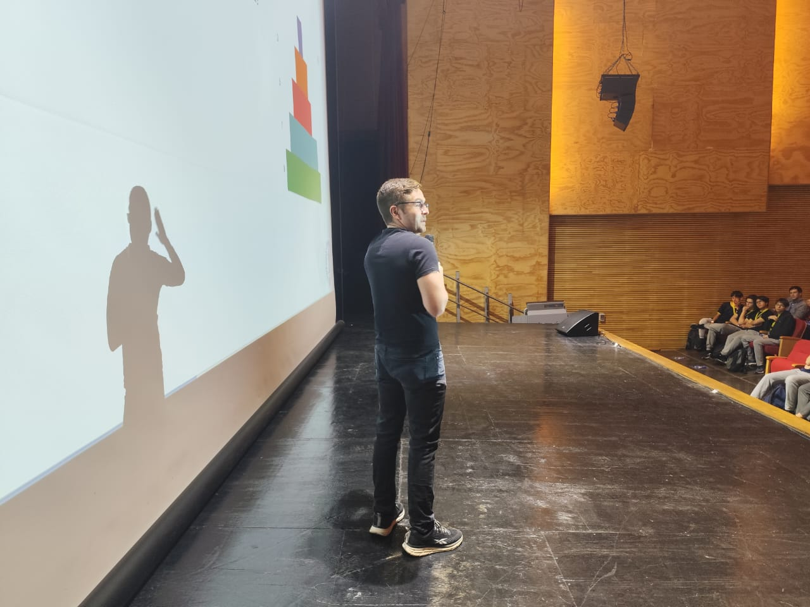
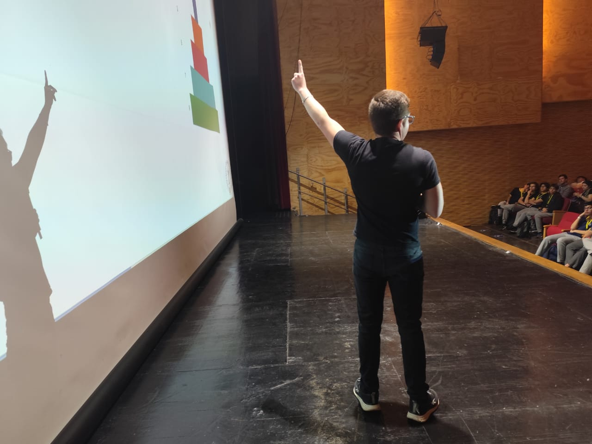
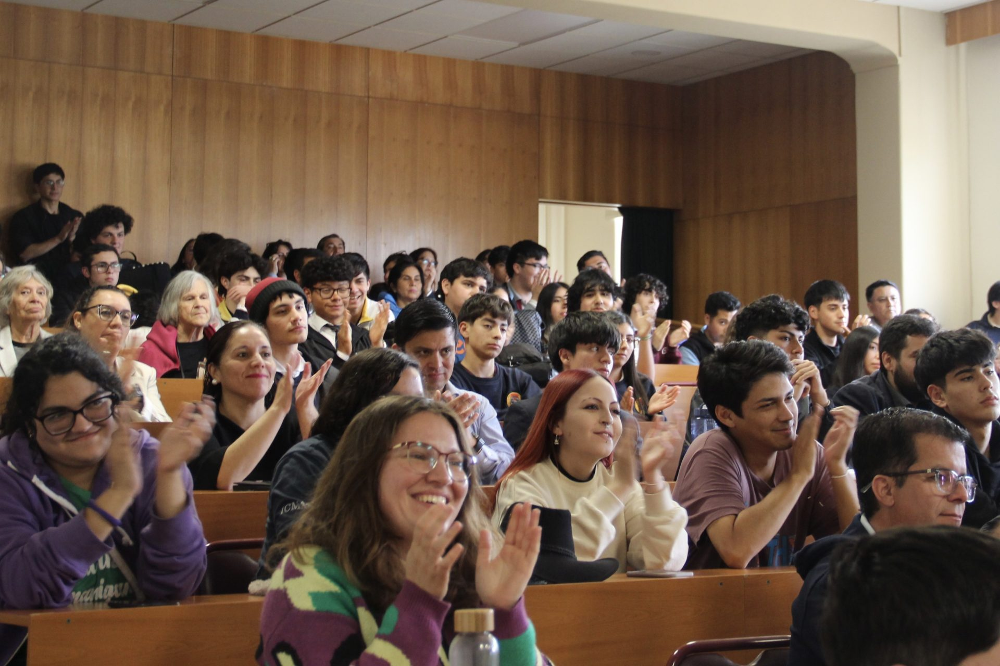
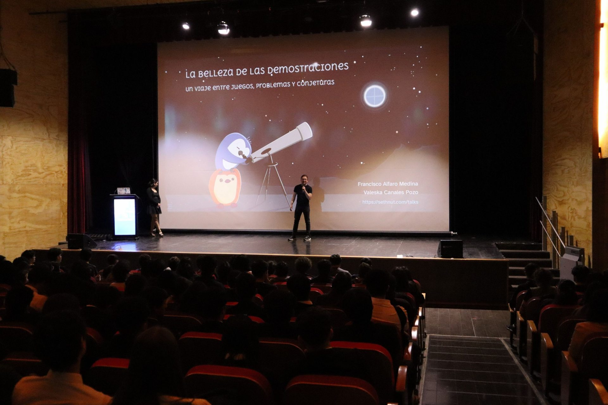
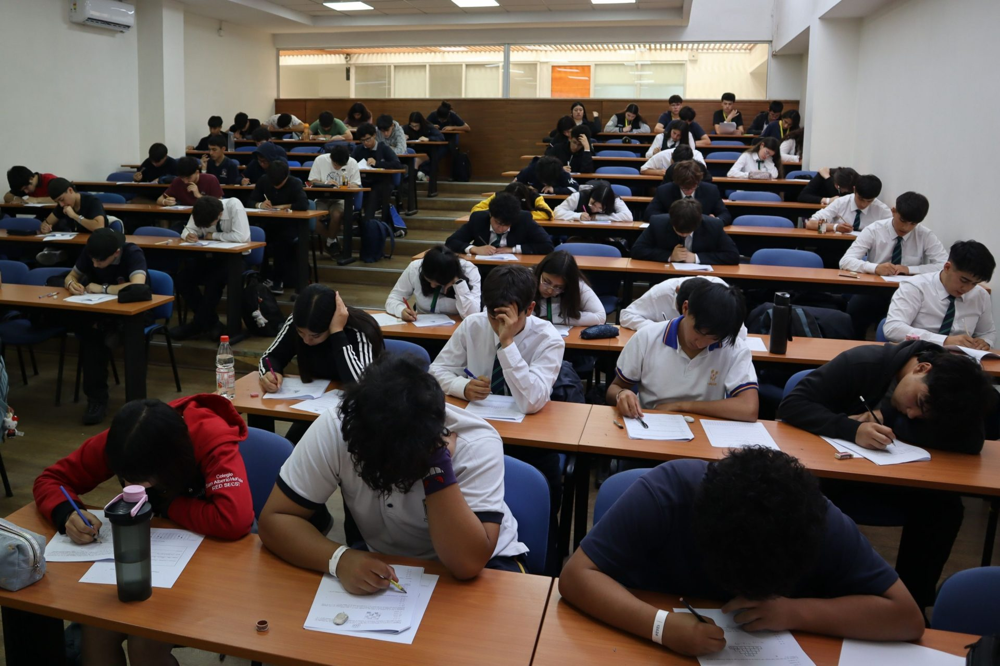
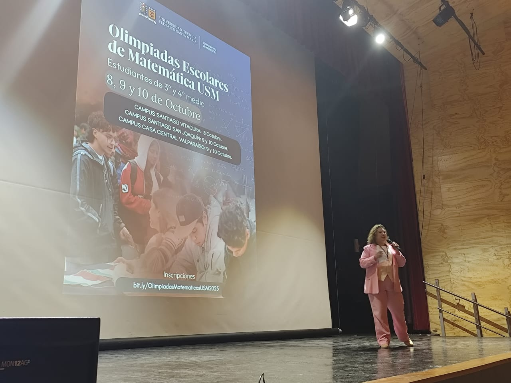
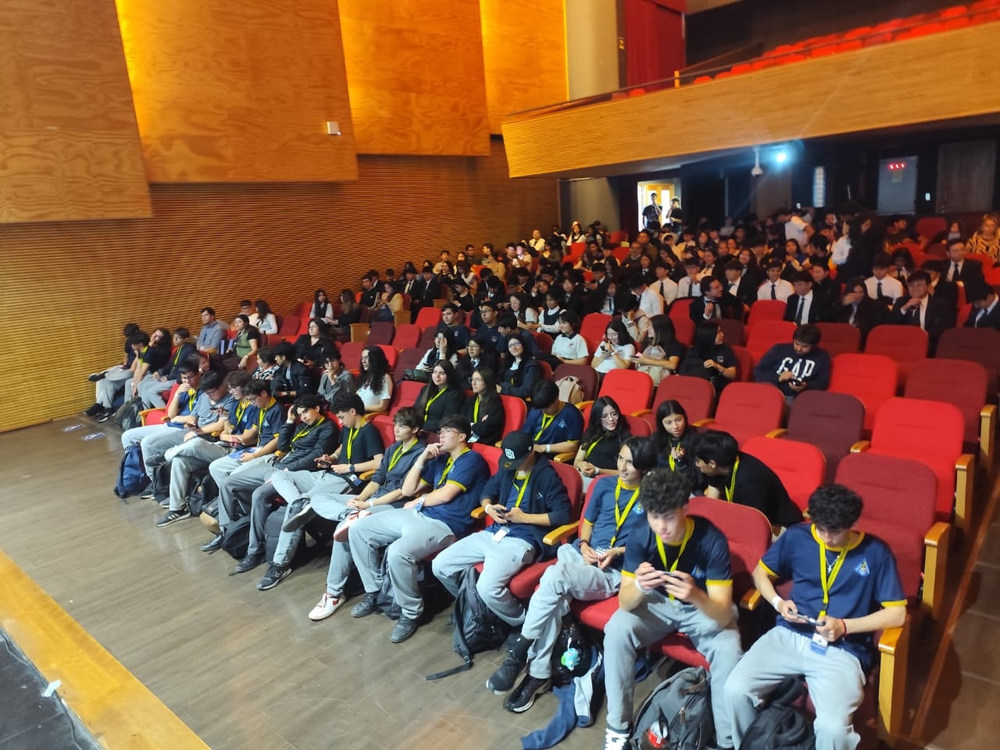
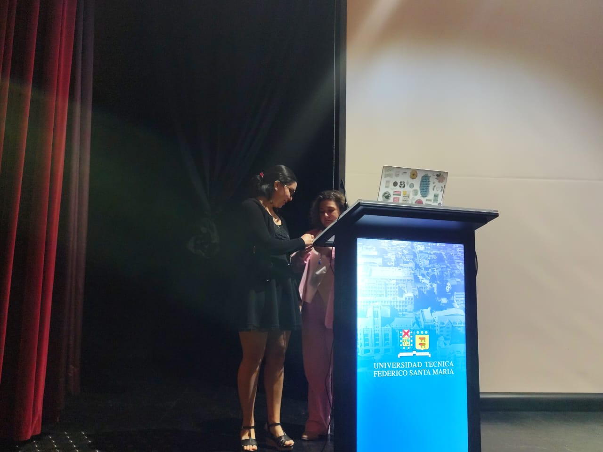

```{r}
#| echo: false
#| results: asis
source(here::here("R/utils.R"))
read_yaml_talks_pt()
```

------------------------------------------------------------------------

## 🎉 Éxito en las **"Olimpiadas Escolares de Matemática UTFSM 2025"**

Durante la reciente edición de las **Olimpiadas Escolares de Matemática 2025**, organizadas por el **Departamento de Matemática de la Universidad Técnica Federico Santa María**, los divulgadores **Francisco Alfaro** y **Valeska Canales** presentaron la charla **"La Belleza de las Demostraciones"**, una invitación a redescubrir el lado creativo, estético y sorprendente de la matemática.

El evento reunió a **más de 400 estudiantes de tercero y cuarto medio** provenientes de distintos establecimientos de la Región de Valparaíso y la Región Metropolitana, consolidándose como una de las actividades escolares más esperadas del año.

Además de las competencias individuales y grupales, las olimpiadas incluyeron talleres para docentes, charlas abiertas y espacios lúdicos que acercaron la matemática a la comunidad de una manera entretenida y participativa.

### 🌟 Contenido Destacado

En esta charla, se abordaron temas diseñados para inspirar la curiosidad y el pensamiento crítico:

-   **Demostraciones clásicas** que revelan patrones ocultos en lo simple, mostrando la elegancia de la deducción matemática.\
-   **Problemas cortos de olimpiadas**, desafiando a los participantes a razonar con ingenio y creatividad.\
-   **Exploraciones computacionales** de conjeturas como **Collatz** y **Goldbach**, utilizando la programación como aliada para descubrir nuevas intuiciones.\
-   **Matemática como arte:** más allá de los resultados, se destacó la belleza de las ideas y el disfrute del proceso de pensar.

### 👏 ¡Gracias Comunidad Matemática!

Agradecemos a todas las y los estudiantes que participaron con entusiasmo, así como al equipo organizador del **Departamento de Matemática USM**, que hizo posible esta jornada en los campus **Casa Central Valparaíso** y **San Joaquín**.\
También extendemos un reconocimiento especial a las y los docentes de los colegios participantes, cuyo compromiso con la enseñanza de la matemática fue clave para el éxito del evento.

### 📅 Próximas Actividades

La charla **“La Belleza de las Demostraciones”** forma parte de una línea de talleres y experiencias de divulgación matemática impulsadas por **Seth&Nut** y la comunidad educativa de la **UTFSM**, orientadas a **despertar la curiosidad científica y fortalecer el pensamiento lógico en estudiantes y profesores**.\
Próximamente se anunciarán nuevas actividades abiertas al público.

### 📷 Fotos del Evento

::: {style="display: grid; grid-template-columns: repeat(1, 1fr); grid-gap: 1em;"}
{group="emma-latex"}
:::

::: {style="display: grid; grid-template-columns: repeat(2, 1fr); grid-gap: 1em;"}
{group="emma-latex"}

{group="emma-latex"}
:::

::: {style="display: grid; grid-template-columns: repeat(3, 1fr); grid-gap: 1em;"}
{group="emma-latex"}

{group="emma-latex"}

{group="emma-latex"}

{group="emma-latex"}

{group="emma-latex"}

{group="emma-latex"}
:::

### 📋 Sobre la Charla

**“La Belleza de las Demostraciones: Un Viaje entre Juegos, Problemas y Conjeturas”** es una charla creada por **Francisco Alfaro** y **Valeska Canales**, que combina rigor matemático, creatividad y exploración computacional.\
A través de ejemplos interactivos, demostraciones visuales y experimentos con código, la charla busca inspirar a nuevas generaciones a **disfrutar la matemática como una aventura intelectual y artística**.

🌐 Más recursos y materiales en: <https://seth-nut.github.io/resources>