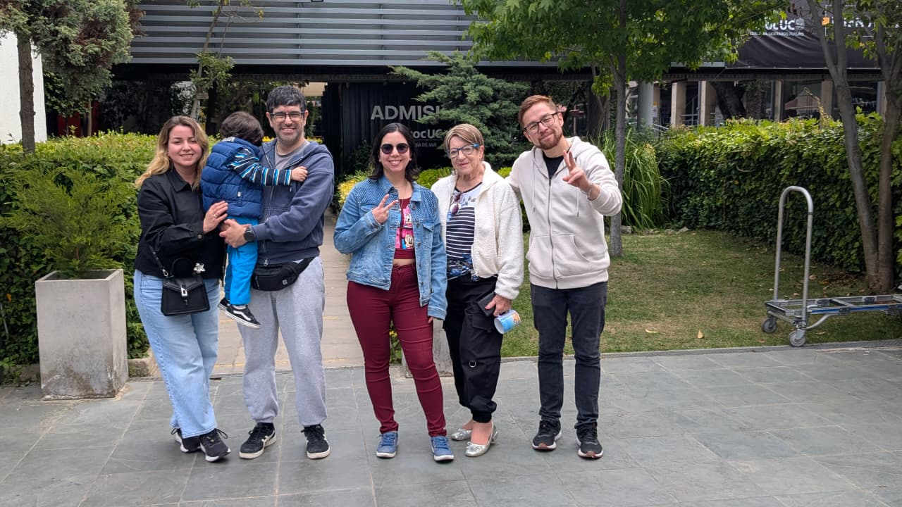
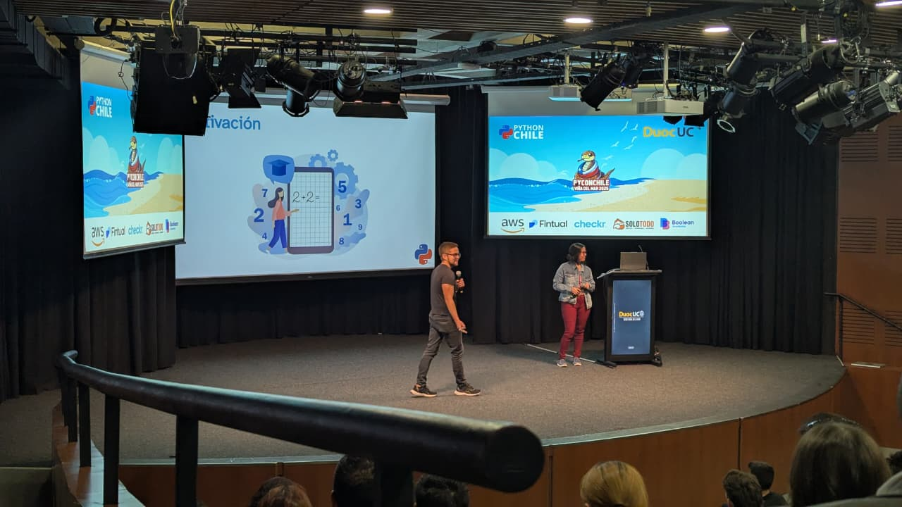
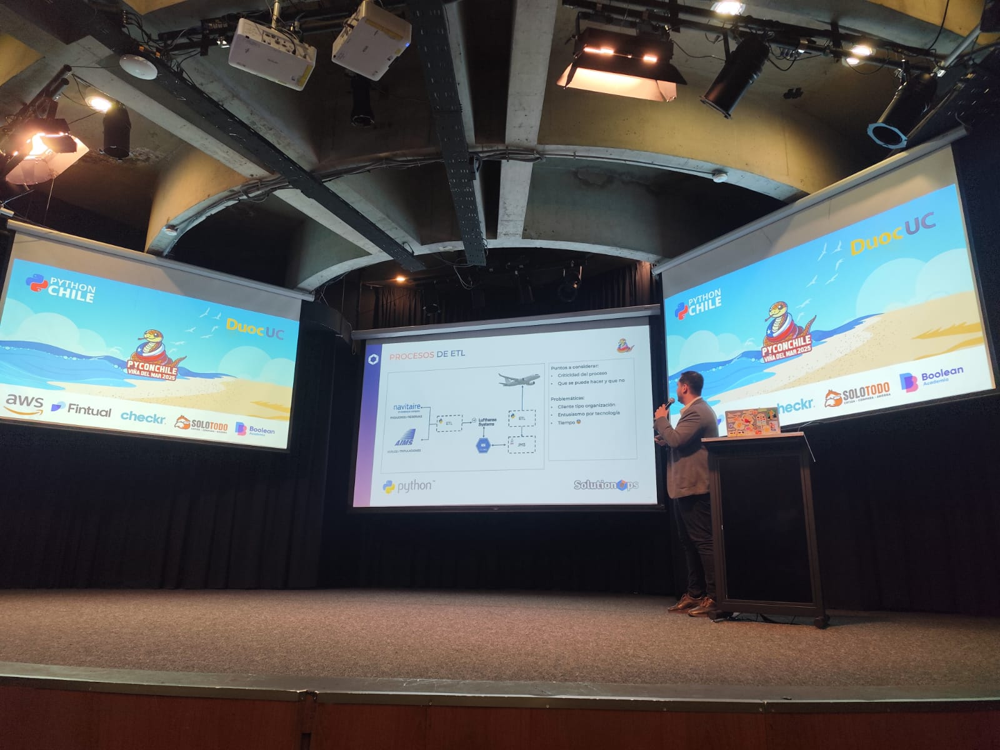
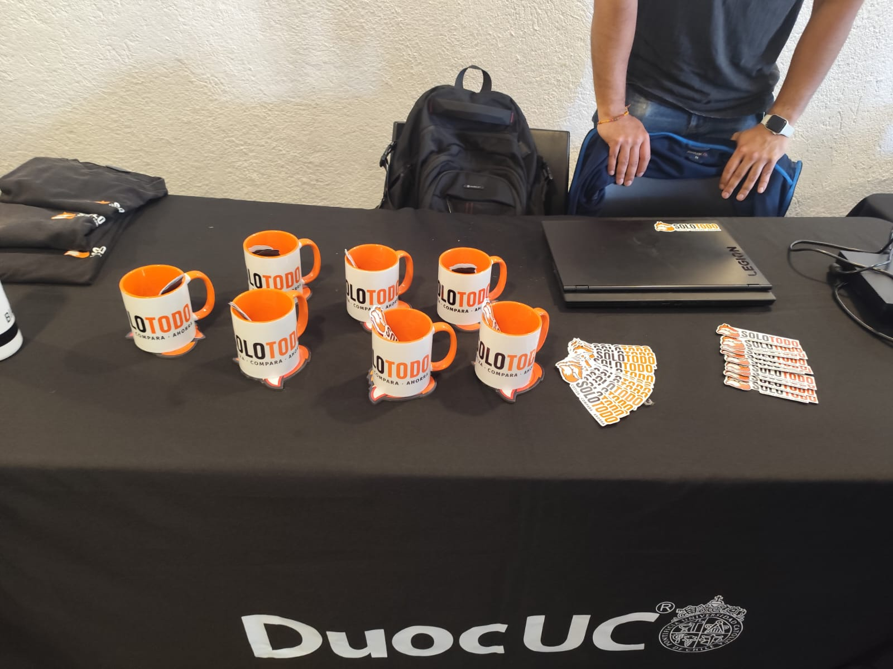
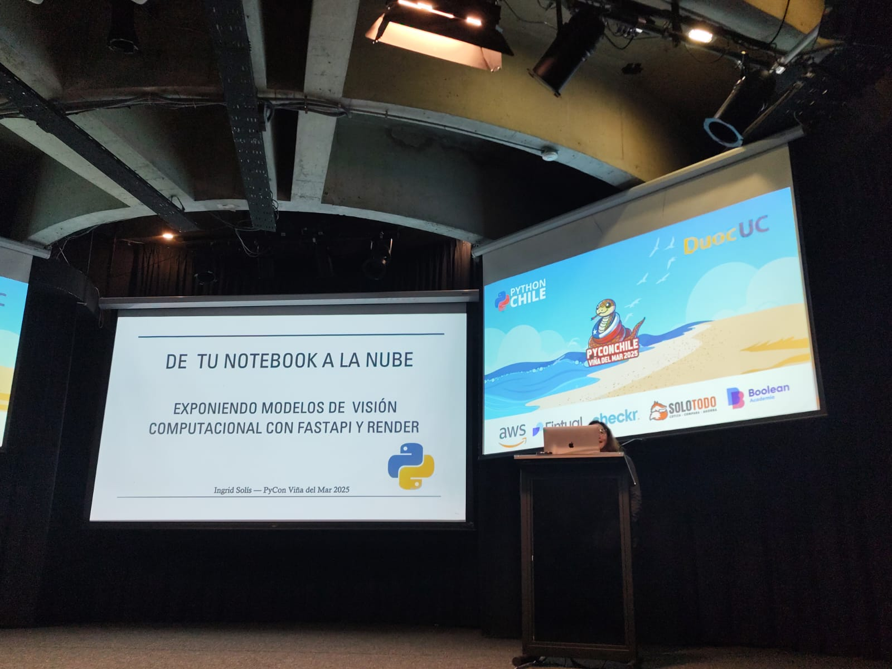

```{r}
#| echo: false
#| results: asis
source(here::here("R/utils.R"))
read_yaml_talks_pt()
```

------------------------------------------------------------------------

## 🎉 Charla en PyCon Chile 2025: *Hola Quarto — Compartir • Colaborar • Enseñar • Reimaginar*

Durante la **PyCon Chile 2025**, realizada en **Santiago** el **8 de noviembre de 2025**, nuestros colaboradores **Francisco Alfaro** y **Valeska Canales** presentaron la charla **“Hola Quarto — Compartir • Colaborar • Enseñar • Reimaginar”**, una invitación a redescubrir el poder de **Quarto** como herramienta abierta para crear, enseñar y comunicar conocimiento reproducible con Python.

El evento reunió a decenas de entusiastas de la comunidad Python chilena, consolidándose como un espacio de encuentro entre desarrolladores, docentes y profesionales que promueven la **educación abierta, la reproducibilidad y la colaboración** en el ecosistema tecnológico.

### 💡 Sobre la Charla

En el ecosistema Python, **crear documentos profesionales y reproducibles** a partir de notebooks sigue siendo un reto. La charla **“Hola Quarto — Compartir • Colaborar • Enseñar • Reimaginar”** mostró cómo **Quarto** y **Python** pueden unirse en un flujo de trabajo único que integra **código, visualizaciones y narrativa**, facilitando la creación de **reportes, presentaciones y sitios web educativos**.

Entre los principales temas abordados destacaron:

-   🧭 **Flujo de trabajo Quarto + Python** para proyectos reproducibles.
-   📄 **Generación de PDFs, sitios web y presentaciones** desde un solo archivo `.qmd`.
-   🧩 **Extensiones interactivas** como *Quarto Quiz*, *Shinylive* y *Pyodide*.
-   🌐 **Publicación abierta y colaboración** con GitHub Pages y Netlify.
-   🧠 **Buenas prácticas docentes** enfocadas en claridad, trazabilidad y reproducibilidad.

### 👏 Agradecimientos

Un agradecimiento especial a la **comunidad de PyCon Chile**, a sus organizadores y voluntarios, por construir un espacio donde convergen la **educación, la programación y la colaboración abierta**.

También a todas las personas que asistieron a la charla y compartieron sus experiencias sobre cómo usar herramientas abiertas para enseñar mejor.

### 📷 Fotos del Evento

::: {style="display: grid; grid-template-columns: repeat(1, 1fr); grid-gap: 1em;"}
{group="pycon-gallery"}

{group="pycon-gallery"}
:::

::: {style="display: grid; grid-template-columns: repeat(3, 1fr); grid-gap: 1em;"}
{group="pycon-gallery"}

{group="pycon-gallery"}

{group="pycon-gallery"}
:::

### 📚 Sobre la Charla

**“Hola Quarto: Aprende, Comparte, Enseña”** es una propuesta de divulgación educativa creada por **Francisco Alfaro**, que busca promover el uso de **herramientas abiertas y reproducibles** en la enseñanza de Python y ciencia de datos.

La charla forma parte de una serie de actividades orientadas a fortalecer la **comunidad Python educativa** y fomentar la adopción de prácticas colaborativas de publicación científica y docente.

🌐 Más recursos en: <https://seth-nut.github.io/resources>