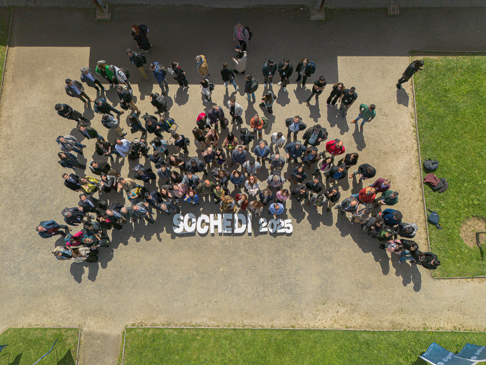
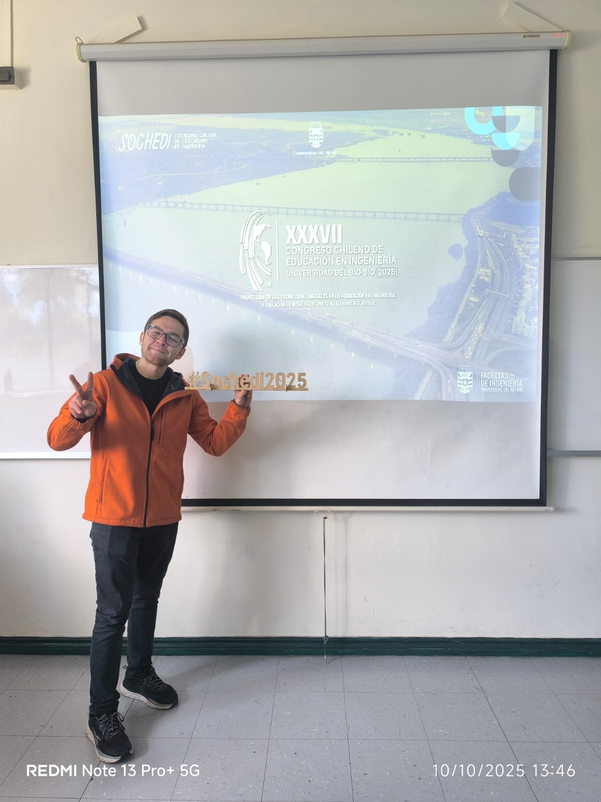
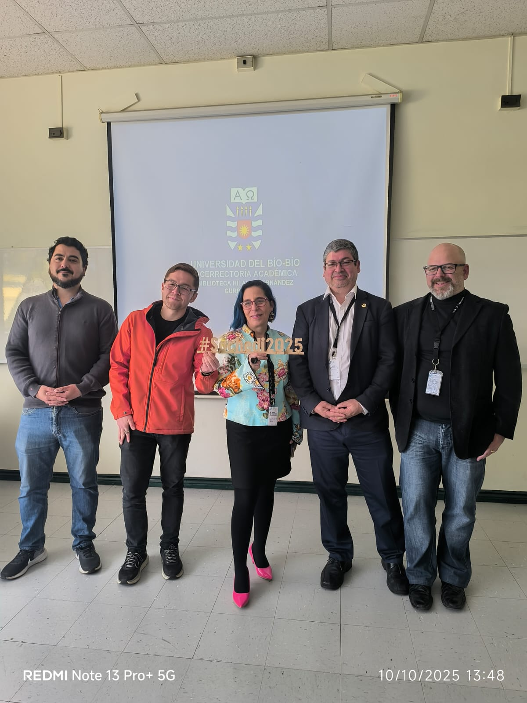
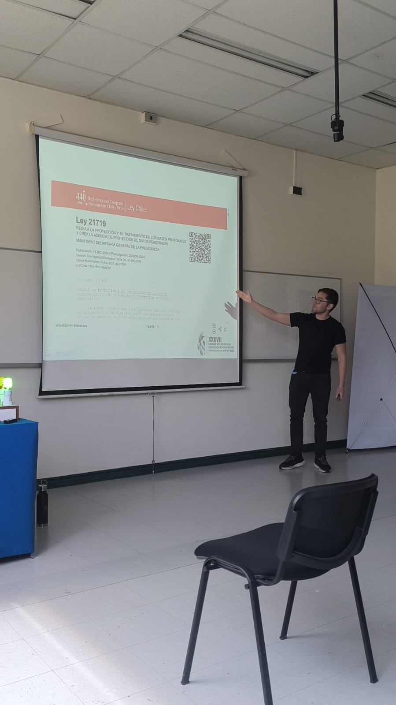
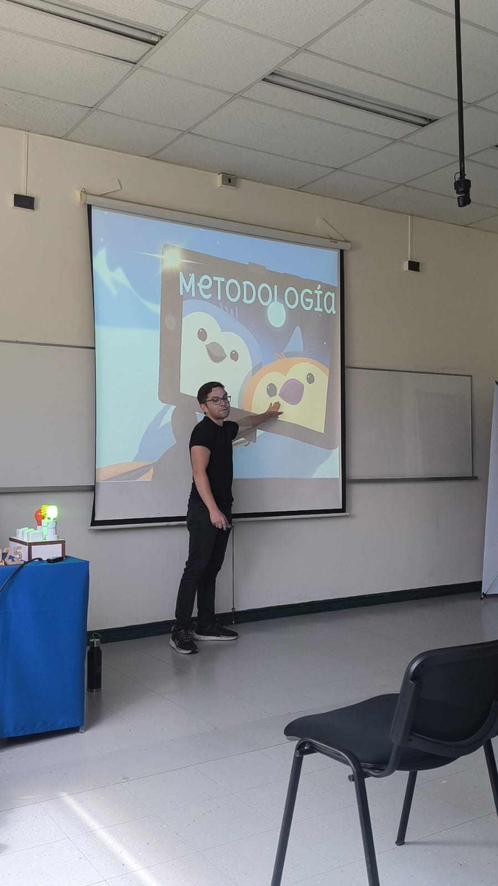
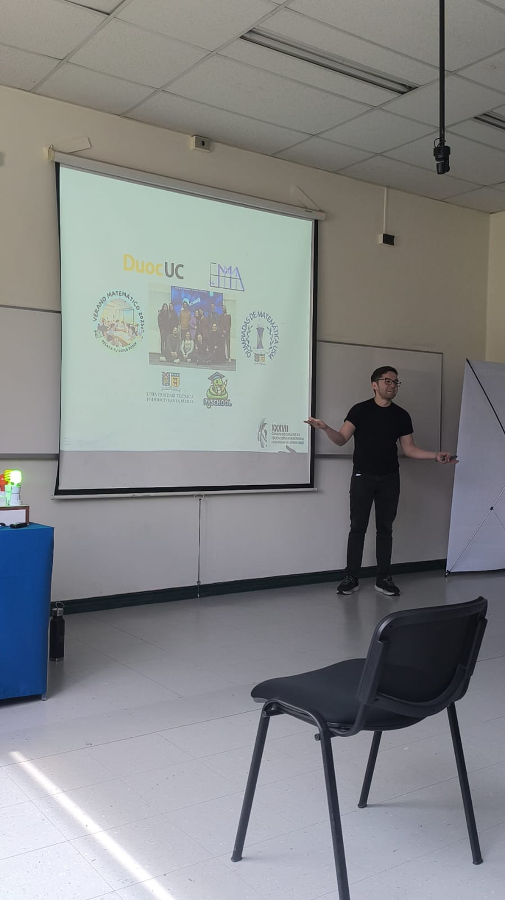
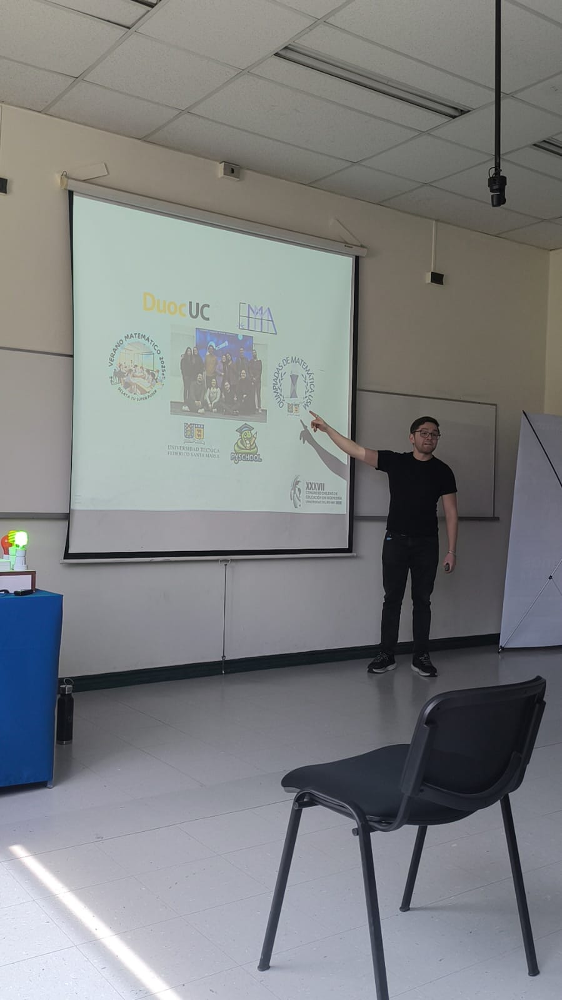

```{r}
#| echo: false
#| results: asis
source(here::here("R/utils.R"))
read_yaml_talks_pt()
```

------------------------------------------------------------------------

## 🎉 Participación en el XXXVII Congreso Chileno de Educación en Ingeniería (SOCHEDI 2025)

Durante la reciente edición del **Congreso Chileno de Educación en Ingeniería (SOCHEDI 2025)**, realizada en la ciudad de **Concepción** y organizada por la **Facultad de Ingeniería de la Universidad del Bío-Bío** junto con la **Sociedad Chilena de Educación en Ingeniería**, se presentaron diversas experiencias y reflexiones en torno a la temática central **“Proyección de las tecnologías digitales en la formación en ingeniería: la educación en modalidades presencial, híbrida y virtual.”**

El encuentro, desarrollado entre los días **8, 9 y 10 de octubre de 2025**, reunió a docentes, investigadores y profesionales de todo el país para dialogar sobre los desafíos que impone la transformación digital en los procesos formativos de ingeniería.

A través de conferencias magistrales, paneles y talleres colaborativos, se promovió el intercambio de estrategias pedagógicas innovadoras orientadas a una educación en ingeniería **más flexible, inclusiva y tecnológicamente integrada**.

## 💡 Charla: *Plataformas Interactivas para la Enseñanza Legal en Ingeniería: Un Caso con Streamlit y Quarto*

La propuesta presentada por el equipo de la **Universidad Técnica Federico Santa María (UTFSM)** consistió en una **plataforma educativa innovadora** que utiliza **Streamlit** y **Quarto**, complementada con herramientas de **inteligencia artificial**, para facilitar la enseñanza de la **Ley 19.628 sobre Protección de Datos Personales** en Chile.

El proyecto busca **traducir conceptos legales complejos** en contenido claro y visualmente atractivo, combinando:

-   Resúmenes comprensibles sobre la reforma legal.\
-   Cuestionarios interactivos para la autoevaluación del aprendizaje.\
-   Visualizaciones que muestran la aplicación práctica de los principios de protección de datos.

La iniciativa promueve una educación **abierta, adaptativa y contextualizada**, orientada tanto a estudiantes universitarios como a docentes y ciudadanía en general, fortaleciendo la comprensión de la normativa legal en contextos tecnológicos.

> -   **Versión interactiva (Streamlit):** <https://ley-datos-personales.streamlit.app/>\
> -   **Versión navegable (Quarto):** <https://seth-nut.github.io/st_proteccion_datos/>

### 📅 Relevancia y Proyección

Esta experiencia demuestra cómo el uso de herramientas **open source** puede potenciar la formación en ingeniería, integrando componentes de **educación legal**, **inteligencia artificial** y **visualización interactiva** dentro del proceso educativo.

Además, aporta un modelo replicable para abordar temáticas interdisciplinarias mediante tecnologías accesibles, fortaleciendo la alfabetización digital y la comprensión ética en torno al uso de datos.

## 📷 Fotos del Evento

::: {style="display: grid; grid-template-columns: repeat(1, 1fr); grid-gap: 1em;"}
{group="emma-latex"}
:::

::: {style="display: grid; grid-template-columns: repeat(2, 1fr); grid-gap: 1em;"}
{group="emma-latex"}

{group="emma-latex"}
:::

::: {style="display: grid; grid-template-columns: repeat(4, 1fr); grid-gap: 1em;"}
{group="emma-latex"}

{group="emma-latex"}

{group="emma-latex"}

{group="emma-latex"}
:::

## 📋 Sobre la Charla

**“Plataformas Interactivas para la Enseñanza Legal en Ingeniería: Un Caso con Streamlit y Quarto”** es una propuesta desarrollada por **Francisco Alfaro**, **Valeska Canales** y **Dorian Villegas**, que busca **democratizar el conocimiento legal mediante herramientas tecnológicas abiertas**.

Combinando el potencial de la **IA generativa**, la **visualización de datos** y la **interactividad**, esta experiencia se enmarca en la misión de promover una **educación universitaria más inclusiva, ética y orientada a la transformación digital.**

🌐 Más recursos y materiales en: <https://seth-nut.github.io/resources>